# Modelo de Datos - Zapp Financial Atelier

Este documento describe el modelo de datos completo de la aplicación Zapp.

## Diagrama ER (Entity Relationship)

```mermaid
erDiagram
    %% ===== ÁREA: SUSCRIPCIONES =====
    Calendar ||--o{ Subscription : "tiene"
    Subscription ||--o{ PriceOverride : "tiene_overrides"
    
    Calendar {
        int id PK
        datetime date UK
    }
    
    Subscription {
        int id PK
        string name
        float price
        string periodicity "monthly|quarterly|semiannual|annual|weekly"
        datetime startDate
        int startDateId FK
        datetime createdAt
    }
    
    PriceOverride {
        int id PK
        int subscriptionId FK
        int year
        int month
        float price
    }

    %% ===== ÁREA: PRESUPUESTO - INGRESOS =====
    IngresoBase ||--o{ PresupuestoIngreso : "tiene_presupuestos"
    
    IngresoBase {
        int id PK
        string nombre UK
        boolean activo
        boolean esRecurrente
        int orden
        datetime createdAt
        datetime updatedAt
    }
    
    PresupuestoIngreso {
        int id PK
        int ingresoId FK
        int anio
        float enero
        float febrero
        float marzo
        float abril
        float mayo
        float junio
        float julio
        float agosto
        float septiembre
        float octubre
        float noviembre
        float diciembre
        datetime createdAt
        datetime updatedAt
    }

    %% ===== ÁREA: PRESUPUESTO - AHORROS =====
    Ahorro ||--o{ PresupuestoAhorro : "tiene_presupuestos"
    
    Ahorro {
        int id PK
        string nombre UK
        boolean activo
        int orden
        datetime createdAt
        datetime updatedAt
    }
    
    PresupuestoAhorro {
        int id PK
        int ahorroId FK
        int anio
        float enero
        float febrero
        float marzo
        float abril
        float mayo
        float junio
        float julio
        float agosto
        float septiembre
        float octubre
        float noviembre
        float diciembre
        datetime createdAt
        datetime updatedAt
    }

    %% ===== ÁREA: SERVICIOS BÁSICOS =====
    ServicioBasico ||--o{ PresupuestoServicioBasico : "tiene_presupuestos"
    ServicioBasico ||--o{ UtilityTransaction : "registra_consumos"
    
    ServicioBasico {
        int id PK
        string nombre UK
        boolean activo
        boolean esBase
        int orden
        string gmailLabel "opcional"
        boolean hasEmailConnector
        datetime createdAt
        datetime updatedAt
    }
    
    PresupuestoServicioBasico {
        int id PK
        int servicioId FK
        int anio
        float enero
        float febrero
        float marzo
        float abril
        float mayo
        float junio
        float julio
        float agosto
        float septiembre
        float octubre
        float noviembre
        float diciembre
        datetime createdAt
        datetime updatedAt
    }
    
    UtilityTransaction {
        int id PK
        string providerKey FK
        datetime transactionDate
        float amount
        string description "opcional"
        string source "manual|email|csv"
        string metadata "JSON opcional"
        datetime createdAt
        datetime updatedAt
    }

    %% ===== ÁREA: SUPERMERCADO =====
    SupermercadoPresupuesto {
        int id PK
        int anio UK
        float enero
        float febrero
        float marzo
        float abril
        float mayo
        float junio
        float julio
        float agosto
        float septiembre
        float octubre
        float noviembre
        float diciembre
        datetime createdAt
        datetime updatedAt
    }

    %% ===== ÁREA: OBLIGACIONES Y CRÉDITOS =====
    Obligacion {
        int id PK
        string nombre
        string tipo "hipotecario|consumo|seguro"
        string moneda "CLP|UF"
        float montoCuota
        int cuotasTotales
        int mesInicio
        int anioInicio
        datetime createdAt
    }

    %% ===== ÁREA: HIPOTECARIO =====
    MortgagePayment {
        int id PK
        int numDiv
        float amortizacionUf
        float interesUf
        float comDIn
        float totalDivUf
        datetime fechaVencimiento
        float saldoInsolutoUf
        datetime createdAt
    }
    
    MortgageBudgetConfig {
        int id PK
        int anioProyectado
        datetime updatedAt
    }
    
    MortgageInsurance {
        int id PK
        string nombre
        string mesAnio "YYYY-MM"
        float monto
        string moneda "CLP|UF"
        datetime createdAt
    }

    %% ===== ÁREA: EJECUCIÓN ACTUAL =====
    ActualEntry {
        int id PK
        int year
        int month
        string category "INGRESOS|SUSCRIPCIONES|OBLIGACIONES|HIPOTECARIO|SERVICIOS_BASICOS|SUPERMERCADO|AJUSTES"
        string itemKey
        string label "opcional"
        int amountClp
        boolean isPaid
        boolean isLocked
        datetime createdAt
        datetime updatedAt
    }

    %% ===== ÁREA: CONFIGURACIÓN =====
    SupuestoAnual {
        int id PK
        int anio UK
        float valorUfBase
        float variacionAnualUf
        datetime createdAt
        datetime updatedAt
    }
    
    GoogleAuthToken {
        int id PK
        string accessToken
        string refreshToken
        datetime expiryDate
        string scope
        string tokenType
        datetime createdAt
        datetime updatedAt
    }
```

## Estructura por Áreas Funcionales

### 1. 📅 Suscripciones
- **Calendar**: Catálogo de fechas para programar suscripciones
- **Subscription**: Suscripciones recurrentes (Netflix, Spotify, etc.)
- **PriceOverride**: Ajustes de precio por mes/año específico

### 2. 💰 Presupuesto
#### Ingresos
- **IngresoBase**: Catálogo de fuentes de ingreso
- **PresupuestoIngreso**: Presupuesto mensual de ingresos por año

#### Ahorros
- **Ahorro**: Catálogo de cuentas/metas de ahorro
- **PresupuestoAhorro**: Presupuesto mensual de ahorros por año

#### Servicios Básicos
- **ServicioBasico**: Catálogo de servicios (Agua, Luz, Gas, Internet, etc.)
- **PresupuestoServicioBasico**: Presupuesto mensual por servicio y año
- **UtilityTransaction**: Transacciones reales/consumos registrados

#### Supermercado
- **SupermercadoPresupuesto**: Presupuesto mensual de supermercado por año

### 3. 🏦 Obligaciones Financieras
#### Créditos Generales
- **Obligacion**: Préstamos de consumo, seguros, etc.

#### Hipotecario
- **MortgagePayment**: Tabla de dividendos hipotecarios precalculada
- **MortgageBudgetConfig**: Configuración del año proyectado
- **MortgageInsurance**: Seguros asociados al crédito hipotecario

### 4. 📊 Ejecución Real
- **ActualEntry**: Registro de montos reales ejecutados mes a mes
  - Consolida todas las categorías: ingresos, gastos, suscripciones, etc.
  - Permite tracking de lo presupuestado vs ejecutado

### 5. ⚙️ Configuración
- **SupuestoAnual**: Parámetros económicos (valor UF, variaciones)
- **GoogleAuthToken**: Credenciales OAuth para integración Gmail

## Patrón de Diseño Principal

El modelo sigue un patrón consistente de **Catálogo + Presupuesto + Actual**:

1. **Catálogo/Base** (ej: `IngresoBase`, `ServicioBasico`, `Ahorro`)
   - Define los *ítems* disponibles
   - Activo/inactivo, orden de visualización

2. **Presupuesto** (ej: `PresupuestoIngreso`, `PresupuestoServicioBasico`)
   - Valores planeados mes a mes para cada año
   - Un registro por año por ítem

3. **Actual/Transacciones** (ej: `ActualEntry`, `UtilityTransaction`)
   - Valores reales ejecutados
   - Permite comparación presupuesto vs real

## Notas Técnicas

- **Base de datos**: SQLite (desarrollo) via Prisma ORM
- **Convenciones**:
  - Nombres de tabla en `snake_case` (via `@@map`)
  - IDs auto-incrementales
  - Timestamps: `createdAt` y `updatedAt` en la mayoría de tablas
  - Soft deletes: Flag `activo` en catálogos
- **Integridad**:
  - `onDelete: Cascade` en presupuestos (si se borra un ítem base, se borran sus presupuestos)
  - Unique constraints en combinaciones año-mes-categoría
