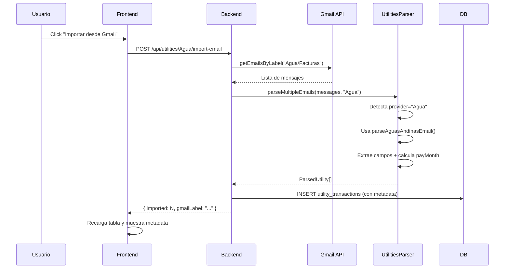

# Parser de Aguas Andinas - Documentación Técnica

**Fecha:** 27 de febrero de 2026  
**Autor:** System  
**Versión:** 1.0

---

## 📋 Resumen

Parser específico para facturas de Aguas Andinas recibidas por Gmail. Extrae información estructurada del cuerpo del correo incluyendo dirección, número de cuenta, período de facturación y calcula automáticamente el mes de pago según reglas de negocio.

---

## 🎯 Objetivo

Automatizar la extracción de datos de boletas de Aguas Andinas desde emails de Gmail para:
1. Reducir entrada manual de datos
2. Mantener histórico de facturación con metadata rica
3. Calcular automáticamente el mes de pago según período de facturación

---

## 📊 Campos Extraídos

| Campo | Descripción | Ejemplo | Tipo |
|-------|-------------|---------|------|
| **address** | Dirección de suministro | "LOS PLATANOS 2071-G 42, MACUL" | string |
| **accountNumber** | Número de cuenta del cliente | "662836-2" | string |
| **periodStart** | Fecha inicio período facturación | "20/01/2026" | string (dd/mm/yyyy) |
| **periodEnd** | Fecha fin período facturación | "17/02/2026" | string (dd/mm/yyyy) |
| **payMonth** | Mes calculado de pago | "2026-03" | string (YYYY-MM) |
| **amount** | Monto de la factura | 52153 | number |
| **transactionDate** | Fecha de transacción (primer día mes de pago) | Date(2026, 2, 1) | Date |

---

## 🔍 Patrones Regex Utilizados

### 1. Dirección
```typescript
/Direcci[óo]n:\s*\n?\s*([^\n]+)/i
```
- **Captura:** Línea siguiente al texto "Dirección:"
- **Flags:** `i` (case-insensitive)
- **Ejemplo match:** "LOS PLATANOS 2071-G 42, MACUL"

### 2. Número de Cuenta
```typescript
/N[úu]mero\s+de\s+Cuenta:\s*\n?\s*([\d\-]+)/i
```
- **Captura:** Dígitos y guiones después de "Número de Cuenta:"
- **Flags:** `i` (case-insensitive)
- **Ejemplo match:** "662836-2"

### 3. Período de Facturación
```typescript
/Per[ií]odo\s+de\s+Facturaci[óo]n:\s*\n?\s*(\d{2})\/(\d{2})\/(\d{4})\s+al\s+(\d{2})\/(\d{2})\/(\d{4})/i
```
- **Captura:** Dos fechas en formato dd/mm/yyyy separadas por " al "
- **Grupos:**
  - Grupo 1-3: Día, mes, año de inicio
  - Grupo 4-6: Día, mes, año de fin
- **Flags:** `i` (case-insensitive)
- **Ejemplo match:** "20/01/2026 al 17/02/2026"

### 4. Monto (reutiliza patrones genéricos)
```typescript
/(?:Total|Monto\s+a\s+pagar|Valor\s+a\s+pagar)[\s:\-]*\$?\s*([\d.,]+)/gi
/\$\s*([\d]{1,3}(?:[.,]\d{3})*)/g
```
- **Captura:** Montos con formato chileno ($52.153 o $52,153)
- **Validación:** Entre $1.000 y $10.000.000
- **Flags:** `gi` (global, case-insensitive)

---

## 💼 Regla de Negocio: Cálculo del Mes de Pago

### Regla
> **La boleta se paga el mes siguiente de la fecha `period_end`**

### Implementación
```typescript
// 1. Parsear period_end
const periodEndDate = new Date(parseInt(endYear), parseInt(endMonth) - 1, parseInt(endDay));

// 2. Agregar 1 mes
const payMonthDate = addMonths(periodEndDate, 1);

// 3. Formatear como YYYY-MM
const payMonth = format(payMonthDate, 'yyyy-MM');
```

### Ejemplo
- **Período de facturación:** 20/01/2026 al 17/02/2026
- **period_end:** 17/02/2026
- **payMonth calculado:** 2026-03 (marzo 2026)
- **transactionDate:** 01/03/2026 (primer día del mes de pago)

### Justificación
- ✅ **NO inventa día de vencimiento** si no aparece en el email
- ✅ Usa el **mes completo** como referencia de pago
- ✅ Compatible con registros de flujo de caja mensual

---

## 📦 Persistencia: Modelo de Datos

### Tabla: `utility_transactions`

| Campo | Tipo | Descripción |
|-------|------|-------------|
| `id` | INTEGER | PK autoincremental |
| `provider_key` | STRING | "Agua" (referencia a ServicioBasico.nombre) |
| `transaction_date` | DATETIME | Primer día del mes de pago |
| `amount` | FLOAT | Monto en CLP |
| `description` | STRING | "Factura Agua - Marzo 2026 (Cuenta: 662836-2)" |
| `source` | STRING | "gmail" |
| `metadata` | STRING | JSON stringificado con campos adicionales |
| `created_at` | DATETIME | Timestamp de creación |
| `updated_at` | DATETIME | Timestamp de actualización |

### Estructura JSON de `metadata`
```json
{
  "address": "LOS PLATANOS 2071-G 42, MACUL",
  "accountNumber": "662836-2",
  "periodStart": "20/01/2026",
  "periodEnd": "17/02/2026",
  "payMonth": "2026-03",
  "gmailMessageId": "18df123abc456..."
}
```

---

## 🔧 Integración con el Sistema

### Flujo de Importación



### Detección Automática
```typescript
// En parseMultipleEmails()
if (providerKey.toLowerCase() === 'agua') {
  result = this.parseAguasAndinasEmail(body, emailDate);
}

// Si falla, cae al parser genérico
if (!result) {
  result = this.parseUtilityEmail(body, emailDate, providerKey);
}
```

---

## 🎨 UI: Visualización de Metadata

### Tabla de Transacciones
- **Columna "Info":** Botón expandible (▶/▼) solo visible si tiene metadata
- **Fila Expandible:** Grid responsive con 4 campos:
  - 📍 Dirección
  - 🔢 N° Cuenta
  - 📅 Período Facturación
  - 💰 Mes de Pago

### Código de Renderizado (React)
```tsx
{isExpanded && hasMetadata && (
  <tr style={{ backgroundColor: '#f9fafb' }}>
    <td colSpan={6} style={{ padding: '1rem' }}>
      <div style={{ 
        display: 'grid', 
        gridTemplateColumns: 'repeat(auto-fit, minmax(200px, 1fr))', 
        gap: '0.75rem' 
      }}>
        {metadata.address && (
          <div>
            <strong>📍 Dirección:</strong>
            <div>{metadata.address}</div>
          </div>
        )}
        {/* ... otros campos ... */}
      </div>
    </td>
  </tr>
)}
```

---

## 📝 Ejemplo Completo de Parsing

### Input: Texto del Correo
```
Estimado cliente,

Dirección:
LOS PLATANOS 2071-G 42, MACUL

Número de Cuenta:
662836-2

Período de Facturación:
20/01/2026 al 17/02/2026

Total a pagar:
$52.153

Gracias por su preferencia.
```

### Output: Objeto ParsedUtility
```typescript
{
  transactionDate: Date(2026, 2, 1), // 01/03/2026
  amount: 52153,
  description: "Factura Agua - Marzo 2026 (Cuenta: 662836-2)",
  metadata: {
    address: "LOS PLATANOS 2071-G 42, MACUL",
    accountNumber: "662836-2",
    periodStart: "20/01/2026",
    periodEnd: "17/02/2026",
    payMonth: "2026-03",
    gmailMessageId: "18df123abc456..."
  }
}
```

### Log de Consola
```
🚰 Parseando email de Aguas Andinas con patrón específico
📅 Período: 20/01/2026 al 17/02/2026 → Mes de pago: 2026-03
✅ Aguas Andinas parseado: Factura Agua - Marzo 2026 (Cuenta: 662836-2) → $52.153
✅ Parseados 1/1 emails de Agua
```

---

## 📁 Archivos Modificados/Creados

### Backend
1. **`node-version/src/services/utilities-parser.service.ts`**
   - ✅ Agregado método `parseAguasAndinasEmail()`
   - ✅ Modificado `parseMultipleEmails()` para detectar provider "Agua"
   - ✅ Importado `addMonths` y `format` de `date-fns`

### Frontend
2. **`node-version/client/src/components/utilities/UtilityTable.tsx`**
   - ✅ Agregado campo `metadata?: string | null` a interfaz `Transaction`
   - ✅ Agregado estado `expandedRows` para filas expandibles
   - ✅ Agregada función `parseMetadata()` para parsear JSON
   - ✅ Agregada columna "Info" con botón expandible
   - ✅ Agregada fila expandible con grid de metadata
   - ✅ Agregado ícono 📧 para source "gmail"

3. **`node-version/client/src/components/utilities/UtilityProviderPanel.tsx`**
   - ✅ Agregado campo `metadata?: string | null` a interfaz `Transaction`

### Documentación
4. **`docs/parser_aguas_andinas.md`** ← Este archivo
   - ✅ Documentación completa del parser
   - ✅ Patrones regex documentados
   - ✅ Regla de negocio explicada
   - ✅ Ejemplos de uso
   - ✅ Diagrama de flujo

---

## 🧪 Testing Manual

### Paso 1: Verificar Label en Gmail
```bash
# Verificar que exista el label configurado
GET http://localhost:3000/api/gmail/labels
# Buscar: "Agua/Facturas" o similar
```

### Paso 2: Configurar Provider
```bash
# En UI: /config/servicios-basicos
# 1. Activar toggle "Conectar con Gmail" para provider "Agua"
# 2. Seleccionar label "Agua/Facturas"
# 3. Guardar
```

### Paso 3: Importar Emails
```bash
# En UI: /actual/utilities → Tab "Agua"
# 1. Click botón "📧 Importar desde Gmail"
# 2. Verificar toast: "✅ N transacciones importadas"
```

### Paso 4: Verificar Metadata
```bash
# 1. En tabla de transacciones, buscar ícono 📧 (source=gmail)
# 2. Click botón ▶ en columna "Info"
# 3. Verificar que se expanda fila con:
#    - 📍 Dirección
#    - 🔢 N° Cuenta
#    - 📅 Período Facturación
#    - 💰 Mes de Pago
```

### Paso 5: Verificar en Base de Datos
```bash
# PowerShell
sqlite3 node-version/prisma/dev.db "SELECT id, amount, metadata FROM utility_transactions WHERE provider_key='Agua' AND source='gmail' LIMIT 1;"

# Output esperado (ejemplo):
# 1|52153|{"address":"LOS PLATANOS...","accountNumber":"662836-2",...}
```

---

## 🔒 Validaciones Implementadas

### 1. Validación de Monto
- ✅ Monto debe estar entre $1.000 y $10.000.000
- ✅ Si no se encuentra monto válido, retorna `null` (no guarda transacción)

### 2. Validación de Fecha
- ✅ Si no se encuentra período de facturación, usa `emailDate` como fallback
- ✅ Fecha de `transactionDate` siempre es primer día del mes calculado

### 3. Manejo de Errores
- ✅ Try-catch en `parseAguasAndinasEmail()` con log de error
- ✅ Fallback a parser genérico si falla parser específico
- ✅ Log detallado en consola del backend para debugging

---

## 🚀 Compatibilidad con Otros Parsers

### Parser Genérico (Fallback)
- El parser genérico sigue funcionando para otros providers (Enel, Gas, Internet, etc.)
- Si falla el parser específico de Aguas Andinas, usa el genérico como respaldo

### Extensibilidad
Para agregar un nuevo parser específico:
1. Crear método `parse[Provider]Email()` en `utilities-parser.service.ts`
2. Agregar condición en `parseMultipleEmails()`:
   ```typescript
   if (providerKey.toLowerCase() === 'luz') {
     result = this.parseEnelEmail(body, emailDate);
   }
   ```
3. Documentar en `docs/parser_[provider].md`

---

## 📊 Métricas de Parsing

### Logs del Backend
```
🚰 Parseando email de Aguas Andinas con patrón específico
📅 Período: 20/01/2026 al 17/02/2026 → Mes de pago: 2026-03
✅ Aguas Andinas parseado: Factura Agua - Marzo 2026 (Cuenta: 662836-2) → $52.153
✅ Parseados 8/10 emails de Agua
📬 Encontrados 10 emails con label "Agua/Facturas"
✅ 8 transacciones importadas (2 duplicados ignorados)
```

### Interpretación
- **8/10 parseados:** 8 emails tuvieron éxito en parsing
- **2 duplicados ignorados:** Ya existían en DB (por `gmailMessageId`)
- **2 no parseados:** No cumplieron formato esperado (caen a parser genérico)

---

## ⚠️ Limitaciones Conocidas

1. **Formato de Email:** Asume que el email de Aguas Andinas sigue el formato especificado
2. **Día de Vencimiento:** NO extrae día exacto de vencimiento (usa primer día del mes)
3. **Moneda:** Asume siempre CLP (no maneja otras monedas)
4. **Regex Estricto:** Pequeñas variaciones en formato pueden hacer fallar el parser

---

## 🔄 Mantenimiento Futuro

### Si cambia formato de emails de Aguas Andinas:
1. Actualizar regex en `parseAguasAndinasEmail()`
2. Agregar tests con nuevos ejemplos
3. Actualizar esta documentación

### Si se requiere extraer más campos:
1. Agregar regex de captura en `parseAguasAndinasEmail()`
2. Agregar campo a objeto `metadata`
3. Actualizar UI en `UtilityTable.tsx` para mostrar nuevo campo

---

## 📞 Contacto y Soporte

Para issues o mejoras relacionadas con este parser:
- Archivo: `node-version/src/services/utilities-parser.service.ts`
- Método: `parseAguasAndinasEmail()`
- Logs: Buscar prefijo "🚰" o "Aguas Andinas" en consola del backend

---

**Fin de la documentación**
