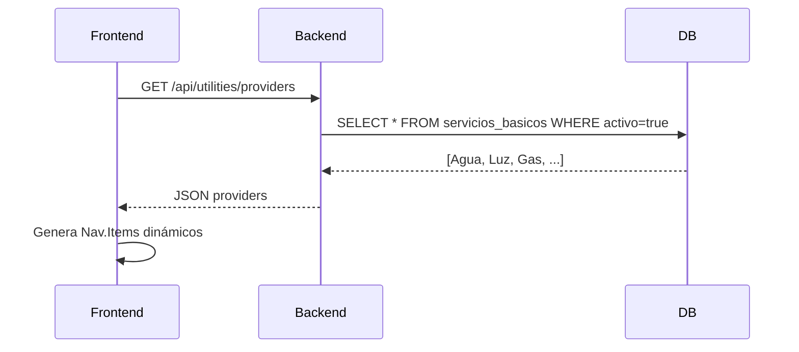
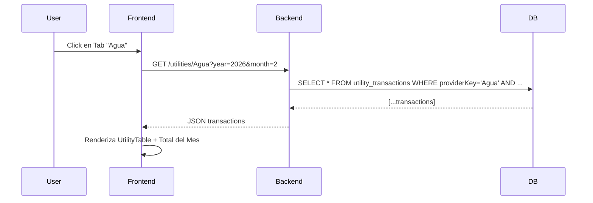
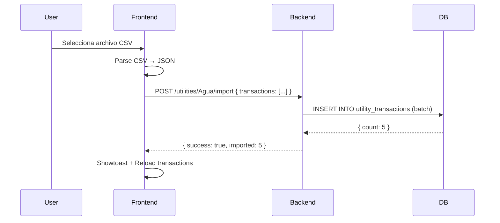

# Arquitectura: Sistema de Servicios Básicos - Vista Actual

## 📋 Contexto

Este documento describe la implementación del sistema de **transacciones reales de Servicios Básicos**, que sigue exactamente la misma arquitectura que el módulo Tenpo TC.

---

## 🎯 Objetivos Cumplidos

1. ✅ **No inventar providers**: Los Tabs se generan dinámicamente desde la tabla `servicios_basicos`
2. ✅ **Seguir patrón Tenpo**: Arquitectura idéntica a `TenpoPurchase` + `TenpoInstallment`
3. ✅ **Sistema extensible**: Preparado para futuros conectores (Gmail, email parsing)
4. ✅ **UX consistente**: Misma experiencia de usuario que ActualTenpo

---

## 📊 Modelo de Datos

### Schema Prisma

```prisma
model ServicioBasico {
  id                Int                              @id @default(autoincrement())
  nombre            String                           @unique
  activo            Boolean                          @default(true)
  esBase            Boolean                          @default(false) @map("es_base")
  orden             Int                              @default(0)
  createdAt         DateTime                         @default(now()) @map("created_at")
  updatedAt         DateTime                         @updatedAt @map("updated_at")
  presupuestos      PresupuestoServicioBasico[]
  transactions      UtilityTransaction[]

  @@map("servicios_basicos")
}

model UtilityTransaction {
  id                Int             @id @default(autoincrement())
  providerKey       String          @map("provider_key") // FK a ServicioBasico.nombre
  provider          ServicioBasico  @relation(fields: [providerKey], references: [nombre], onDelete: Cascade)
  transactionDate   DateTime        @map("transaction_date")
  amount            Float           // Monto en CLP
  description       String?         
  source            String          @default("manual") // manual | email | csv
  metadata          String?         // JSON string para extensibilidad futura
  createdAt         DateTime        @default(now()) @map("created_at")
  updatedAt         DateTime        @updatedAt @map("updated_at")

  @@map("utility_transactions")
}
```

### Relación con Sistema Existente

- **`ServicioBasico`**: Ya existía para presupuestos. Se agregó relación `transactions`.
- **`UtilityTransaction`**: Nuevo modelo análogo a `TenpoPurchase`.
- La FK `providerKey` referencia directamente el **nombre** del servicio, permitiendo providers dinámicos.

---

## 🔌 API Endpoints

### Backend: `node-version/src/routes/utilities.ts`

| Método | Endpoint | Descripción |
|--------|----------|-------------|
| `GET` | `/api/utilities/providers` | Lista providers activos de Servicios Básicos |
| `GET` | `/api/utilities/:provider` | Transacciones de un provider (filtro year/month opcional) |
| `GET` | `/api/utilities/:provider/summary` | Resumen mensual anual por provider |
| `POST` | `/api/utilities/:provider` | Crear transacción manual |
| `POST` | `/api/utilities/:provider/import` | Importar transacciones desde CSV |
| `DELETE` | `/api/utilities/:provider/:id` | Eliminar transacción |

### Ejemplo de Uso

**Obtener providers:**
```bash
GET /api/utilities/providers
```

**Respuesta:**
```json
[
  { "id": 1, "nombre": "Agua", "esBase": true, "orden": 1 },
  { "id": 2, "nombre": "Luz", "esBase": true, "orden": 2 },
  { "id": 3, "nombre": "Gas", "esBase": true, "orden": 3 }
]
```

**Obtener transacciones del mes:**
```bash
GET /api/utilities/Agua?year=2026&month=2
```

**Importar CSV:**
```bash
POST /api/utilities/Agua/import
Content-Type: application/json

{
  "transactions": [
    { "date": "2026-02-15", "amount": 12500, "description": "Mes enero 2026" },
    { "date": "2026-02-20", "amount": 8000, "description": "Ajuste consumo" }
  ]
}
```

---

## 💡 Semántica: Importar = Registrar Pago (Flujo de Caja)

### Concepto Clave

> **"Importar desde Gmail" NO registra deudas ni boletas pendientes. Registra pagos ya realizados en el flujo de caja "Actual".**

### Contexto

Este sistema sigue la misma filosofía que el módulo Tenpo:
- Las transacciones importadas representan **egresos reales** que ya ocurrieron
- El campo `transactionDate` indica **cuándo se registra el pago en Actual** (flujo de caja)
- No es un sistema de gestión de boletas o deudas pendientes

### Flujo Conceptual

```
┌──────────────────┐
│  Email de Boleta │ (Ej: "Período: 20/01 al 17/02")
└────────┬─────────┘
         │ Parser extrae información
         │
         ▼
┌──────────────────────────────────────────────────┐
│  Calcula mes de pago: period_end + 1 mes         │
│  Resultado: payMonth = "2026-03"                 │
└────────┬─────────────────────────────────────────┘
         │
         ▼
┌──────────────────────────────────────────────────┐
│  Crea UtilityTransaction:                        │
│  - transactionDate: 01/03/2026 (primer día mes)  │
│  - amount: $52.153                               │
│  - source: "gmail"                               │
│  - metadata: { periodStart, periodEnd, ... }     │
└────────┬─────────────────────────────────────────┘
         │
         ▼
┌──────────────────────────────────────────────────┐
│  Usuario ve en "Actual" (Marzo 2026):            │
│  ✅ Egreso de $52.153 por Agua                   │
│  (No es una boleta pendiente, es un pago real)   │
└──────────────────────────────────────────────────┘
```

### Reglas de Negocio

1. **Parser de Aguas Andinas:**
   - Extrae `periodEnd` del email
   - Calcula `payMonth = periodEnd + 1 mes`
   - Usa `payMonth` como base para `transactionDate`

2. **Registro en Actual:**
   - `transactionDate` = primer día del mes de pago
   - Representa el mes en que el usuario **registró/realizó el pago**
   - Visible en vista "Actual" del mes correspondiente

3. **No es gestión de vencimientos:**
   - NO guarda fecha exacta de vencimiento (a menos que venga en el email)
   - NO es sistema de alertas de boletas pendientes
   - Es registro de flujo de caja real

### Response del Endpoint

El endpoint `POST /api/utilities/:provider/import-email` retorna:

```json
{
  "success": true,
  "imported": 5,
  "gmailLabel": "Agua/Facturas",
  "skipped": 2,
  "mode": "cashflow_actual",
  "payMonth": "2026-03",
  "message": "Importadas 5 transacciones nuevas desde Gmail label..."
}
```

**Campos clave:**
- `mode: "cashflow_actual"` → Indica que se registraron pagos en Actual (no deudas)
- `payMonth` → Ejemplo del mes de pago calculado (útil para verificación)

### UI: Mensaje Explicativo

En `UtilityImportCard.tsx` se muestra:

```
💡 Importante: Importar desde Gmail registra pagos ya realizados en "Actual" (flujo de caja).
   No registra deudas ni boletas pendientes.
```

Esto aclara al usuario que:
- ✅ Se registra el egreso en el mes de pago
- ❌ NO se crea seguimiento de boletas pendientes
- ❌ NO se generan alertas de vencimiento

### Diferencia con otros sistemas

| Concepto | Sistema Utilities (este) | Sistema de Boletas (hipotético) |
|----------|--------------------------|----------------------------------|
| **Objetivo** | Registrar flujo de caja real | Gestionar deudas y vencimientos |
| **transactionDate** | Fecha del pago realizado | Fecha de vencimiento |
| **Importar email** | "Ya pagué" → registro en Actual | "Llegó boleta" → pendiente |
| **Alertas** | No aplica | Alerta X días antes |
| **source="gmail"** | Pago parseado de email | Boleta parseada de email |

---

## 🎨 Frontend

### Estructura de Componentes

```
pages/
  ActualUtilities.tsx          → Vista principal con tabs dinámicos

components/utilities/
  UtilityProviderPanel.tsx     → Panel por provider (análogo a ActualTenpo)
  UtilityImportCard.tsx        → Card de importación CSV
  UtilityTable.tsx             → Tabla de transacciones
```

### Vista Principal: `ActualUtilities.tsx`

**Responsabilidades:**
- Consulta `/api/utilities/providers` al cargar
- Genera **Tabs dinámicos** con `rsuite/Nav`
- Monta `<UtilityProviderPanel>` según tab activo
- Propaga year/month desde `YearMonthPicker`

**Código clave:**
```tsx
{providers.map(provider => (
  <Nav.Item key={provider.nombre} eventKey={provider.nombre}>
    {provider.nombre}
  </Nav.Item>
))}

{activeTab && (
  <UtilityProviderPanel
    provider={activeTab}
    year={year}
    month={month}
    onDataChange={loadProviders}
  />
)}
```

### Panel por Provider: `UtilityProviderPanel.tsx`

**Responsabilidades:**
- Carga transacciones de `/api/utilities/:provider?year=X&month=Y`
- Renderiza `<UtilityImportCard>` y `<UtilityTable>`
- Muestra **total del mes siempre visible** (sticky style)
- Maneja importación CSV y creación manual

**Patrón seguido:**
- Idéntico a la estructura de `Tenpo.tsx` y `ActualTenpo.tsx`
- No genera doble scroll (tabla en card con overflow controlado)

### Card de Importación: `UtilityImportCard.tsx`

**Formato CSV esperado:**
```csv
fecha,monto,descripcion
2026-02-15,12500,Pago agua mes enero
2026-02-20,8000,Ajuste
```

**Features:**
- Botón "Importar CSV" con `<input type="file" />`
- Botón "Agregar Manual" para ingreso rápido

### Tabla: `UtilityTable.tsx`

**Columnas:**
- Fecha (formato `dd MMM yyyy`)
- Monto (alineado derecha, formato chileno)
- Descripción
- Origen (badge: manual ✍️ / csv 📄)
- Acciones (botón eliminar 🗑️)

---

## 🔄 Flujo de Datos

### 1. Carga Inicial



### 2. Selección de Tab



### 3. Importación CSV



---

## 🧩 Detección de Providers

### ¿Cómo se detectan los providers?

1. **No están hardcodeados** en el frontend.
2. Se consulta **dinámicamente** desde la tabla `servicios_basicos`:
   ```sql
   SELECT nombre FROM servicios_basicos WHERE activo = true ORDER BY orden, nombre
   ```
3. Los Tabs se generan en tiempo de ejecución usando `providers.map()`.

### ¿Cómo se agregan nuevos providers?

**Opción 1: Desde el frontend (ya existente)**
- Ir a `/servicios-basicos` (página de presupuesto)
- Click en "⚙️ Gestionar Servicios"
- Agregar nuevo servicio (ej: "Internet", "Telefonía")
- Automáticamente aparecerá en la vista Actual

**Opción 2: Seed manual en DB**
```sql
INSERT INTO servicios_basicos (nombre, activo, esBase, orden) 
VALUES ('Internet', true, true, 4);
```

---

## 🔮 Extensibilidad Futura

### 1. Email Connectors - Gmail Label Dinámico ✅ IMPLEMENTADO

El sistema ahora soporta importación automática desde Gmail usando labels configurados por provider.

#### Modelo de Datos

```prisma
model ServicioBasico {
  // ... campos existentes
  gmailLabel        String?  @map("gmail_label")        // Ej: "Facturación ENEL"
  hasEmailConnector Boolean  @default(false) @map("has_email_connector")
}
```

#### Configuración en Base de Datos

Para habilitar el email connector en un provider:

```sql
UPDATE servicios_basicos 
SET gmail_label = 'Facturación ENEL',
    has_email_connector = true
WHERE nombre = 'Luz';
```

**Campos:**
- `gmailLabel`: Nombre exacto del label en Gmail (case-sensitive)
- `hasEmailConnector`: Flag que activa/desactiva la funcionalidad

#### Backend: Endpoint de Importación

**Endpoint creado:**
```
POST /api/utilities/:provider/import-email
```

**Flujo:**
1. Busca el `ServicioBasico` por `nombre = :provider`
2. Valida que `hasEmailConnector = true`
3. Obtiene `gmailLabel` desde la base de datos
4. **Por ahora**: Mock de 2 transacciones de ejemplo
5. **Futuro**: Llamada real a Gmail API usando el label dinámico
6. Inserta transacciones con `source = 'gmail'` y `metadata` con `gmailLabel`

**Respuesta exitosa:**
```json
{
  "success": true,
  "imported": 2,
  "gmailLabel": "Facturación ENEL",
  "message": "Importadas 2 transacciones desde Gmail label \"Facturación ENEL\""
}
```

#### Frontend: Botón Condicional

**Modificaciones en `UtilityImportCard.tsx`:**
- Si `provider.hasEmailConnector = true` → muestra badge azul con el label configurado
- Botón verde "📧 Importar desde Gmail" aparece dinámicamente
- Estado de carga (`importingEmail`) durante la operación

**Código clave:**
```tsx
{hasEmailConnector && (
  <Button 
    appearance="primary" 
    color="green"
    onClick={onImportEmail}
    loading={importingEmail}
  >
    📧 Importar desde Gmail
  </Button>
)}
```

#### GET /api/utilities/providers - Campos Agregados

El endpoint ahora devuelve:
```json
[
  {
    "id": 1,
    "nombre": "Luz",
    "esBase": true,
    "orden": 1,
    "hasEmailConnector": true,
    "gmailLabel": "Facturación ENEL"
  },
  {
    "id": 2,
    "nombre": "Agua",
    "esBase": true,
    "orden": 2,
    "hasEmailConnector": false,
    "gmailLabel": null
  }
]
```

#### Escalabilidad: Múltiples Labels

**Caso de uso:** Un provider puede tener múltiples labels (ej: "Factura ENEL", "Boleta ENEL").

**Opción 1: Array en metadata (futuro)**
```prisma
model ServicioBasico {
  gmailLabels String? // JSON array: ["Facturación ENEL", "Boleta ENEL"]
}
```

**Opción 2: Tabla separada (recomendado para escala)**
```prisma
model UtilityEmailLabel {
  id          Int     @id @default(autoincrement())
  providerId  Int     @map("provider_id")
  gmailLabel  String  @map("gmail_label")
  isActive    Boolean @default(true)
  provider    ServicioBasico @relation(...)
}
```

#### Integración Real con Gmail (Pendiente)

**Pasos para habilitar OAuth:**
1. Reutilizar `GoogleAuthToken` existente (ya usado en Tenpo)
2. Crear service `utilities-gmail.service.ts` (análogo a `gmail.service.ts`)
3. Función `searchEmailsByLabel(label: string)` usando Gmail API
4. Parser específico por provider (ej: `enel-parser.service.ts`)

**Ejemplo de parser ENEL:**
```typescript
export class EnelParserService {
  parseEmailBody(body: string): UtilityTransaction | null {
    // Buscar patrón: "Total a pagar: $XX.XXX"
    // Extraer fecha de vencimiento
    // Retornar objeto transaction
  }
}
```

#### Ventajas del Diseño Dinámico

✅ **No hardcoded**: Cero lógica específica de "ENEL" en el código  
✅ **DB-driven**: Cambiar label = UPDATE en base de datos  
✅ **Escalable**: Agregar providers con email = configurar 2 campos  
✅ **Reusable**: Mismo endpoint para Luz, Gas, Agua, Internet, etc.  
✅ **UI automática**: Botón aparece/desaparece según configuración  

#### Testing Manual

1. Configurar un provider en DB:
   ```sql
   UPDATE servicios_basicos 
   SET gmail_label = 'Test/Facturas',
       has_email_connector = true
   WHERE nombre = 'Luz';
   ```

2. Recargar `/actual/utilities`
3. Entrar al tab "Luz"
4. Ver badge azul con "Gmail Label: Test/Facturas"
5. Click en "📧 Importar desde Gmail"
6. Mock crea 2 transacciones de ejemplo
7. Verificar que aparezcan en la tabla con badge "📄" (source: gmail)

---

### 2. Provider-Specific Logic (Anterior)

El campo `source` permite rastrear el origen:
- `manual`: Ingreso manual
- `csv`: Importación CSV
- `gmail`: Futuro conector Gmail (similar a Tenpo)

**Ejemplo de extensión:**
```typescript
// services/utilities/enel-parser.service.ts
export class EnelParserService {
  parseEmail(emailBody: string): UtilityTransaction {
    // Parsear email de ENEL
    // Extraer fecha, monto, número de cliente
    return {
      providerKey: 'Luz',
      transactionDate: extractedDate,
      amount: extractedAmount,
      description: 'Email ENEL',
      source: 'gmail',
      metadata: JSON.stringify({ clientNumber: '...' })
    };
  }
}
```

### 2. Provider-Specific Logic

El campo `metadata` (JSON string) permite almacenar datos específicos:

**Ejemplo Agua:**
```json
{
  "meterReading": "12345 m³",
  "consumptionPeriod": "2026-01-01 a 2026-01-31"
}
```

**Ejemplo Gas:**
```json
{
  "tariffType": "T1",
  "consumptionM3": 45.2
}
```

---

## 🆚 Comparación con Tenpo

| Aspecto | Tenpo TC | Servicios Básicos |
|---------|----------|-------------------|
| **Modelo principal** | `TenpoPurchase` | `UtilityTransaction` |
| **Modelo secundario** | `TenpoInstallment` | *(no aplica, transacciones únicas)* |
| **Fuente de datos** | Gmail API + parser | CSV + manual (futuro: email) |
| **Provider dinámico** | ❌ (solo Tenpo) | ✅ (desde `servicios_basicos`) |
| **Cálculo de interés** | ✅ Complejo | ❌ N/A |
| **Resumen mensual** | Suma cuotas del mes | Suma transacciones del mes |
| **UX tabla** | Expandible con cuotas | Flat (una fila = una transacción) |

---

## 🚀 Integración con Sistema Existente

### Relación con Presupuesto

- La tabla `servicios_basicos` es **compartida** entre:
  - `/servicios-basicos` → Presupuesto (PresupuestoServicioBasico)
  - `/actual/utilities` → Actual (UtilityTransaction)

- Si se desactiva un servicio (`activo = false`), desaparece de ambas vistas.

### Relación con Vista Actual

En el futuro, `ActualEntry` podría consolidar:
```typescript
// Pseudocódigo
const serviciosBasicosTotal = await prisma.utilityTransaction.aggregate({
  where: { transactionDate: { gte: startMonth, lte: endMonth } },
  _sum: { amount: true }
});

await prisma.actualEntry.upsert({
  where: { year_month_category_itemKey: [year, month, 'SERVICIOS_BASICOS', 'TOTAL'] },
  update: { amountClp: serviciosBasicosTotal._sum.amount },
  create: { /* ... */ }
});
```

---

## 📝 Rutas y Navegación

### Router: `client/src/router.tsx`

```tsx
<Route path="/actual/utilities" element={<ActualUtilities />} />
```

### Sidebar: `client/src/navigation/menuConfig.ts`

```typescript
{
  key: 'actual',
  label: 'Actual',
  children: [
    { key: '/actual/utilities', label: '    Servicios Básicos' },
    // ...
  ]
}
```

---

## 🛠️ Decisiones Técnicas

### 1. Relación `providerKey → nombre` (String FK)

**Decisión:** Usar FK string en lugar de `servicioId` (INT).

**Razón:**
- Permite que los Tabs sean legibles (`provider="Agua"` vs `provider=1`)
- Simplifica URLs: `/api/utilities/Agua` vs `/api/utilities/1`
- Mantiene consistencia con patrón usado en `TcBillingConfig.tcKey`

**Trade-off:**
- ⚠️ Si se renombra un servicio, las transacciones quedan huérfanas
- ✅ Mitigación: La UI no permite renombrar servicios base (`esBase=true`)

### 2. Campo `source` en lugar de `emailId`

**Decisión:** Campo enum string `source` (manual | csv | gmail) en lugar de FK a tabla emails.

**Razón:**
- No todos los providers tendrán emails (ej: CSV manual de boleta papel)
- Campo genérico permite futuras fuentes (API, scraping web)
- Similar a `TenpoPurchase.source`

### 3. Transacciones flat (no nested installments)

**Decisión:** Una transacción = un pago completo (sin cuotas).

**Razón:**
- Los servicios básicos se pagan una vez al mes
- No aplica interés ni calendario de pagos
- Simplifica modelo y UX (tabla flat vs expandible)

### 4. Tabs dinámicos vs Selector

**Decisión:** Usar `rsuite/Nav` con Tabs horizontales.

**Razón:**
- Más rápido cambiar entre providers (1 click vs 2 clicks en selector)
- Visualmente más claro qué providers están disponibles
- Consistente con UX de otras aplicaciones (ej: GitHub tabs)

---

## ✅ Checklist de Compliance con Requerimiento

| Requisito | Estado | Implementación |
|-----------|--------|----------------|
| No inventar nombres de providers | ✅ | Consulta dinámica desde DB |
| Seguir arquitectura Tenpo | ✅ | Patrón idéntico: routes + service + panel + tabla |
| Generar Tabs dinámicos | ✅ | `Nav.Item` mapeados desde `providers.map()` |
| Card de importación CSV | ✅ | `UtilityImportCard.tsx` |
| Tabla reutilizable | ✅ | `UtilityTable.tsx` |
| Total del mes visible | ✅ | Card sticky con total calculado |
| Agregar manual | ✅ | Prompt básico (mejora futura: modal) |
| Eliminar transacción | ✅ | Botón 🗑️ con confirmación |
| Sin doble scroll | ✅ | `overflowX: auto` solo en tabla |
| Backend con endpoints RESTful | ✅ | 6 endpoints implementados |
| Arquitectura extensible | ✅ | Campo `metadata` + `source` para futuros conectores |

---

## �️ Vista Anual (Actualización 27/02/2026)

### Cambio de Alcance: Mensual → Anual

**Motivación:** Eliminar fricción del selector mensual. Los servicios básicos son gastos recurrentes que se analizan mejor de forma anual con comparativas YoY.

### Cambios Implementados

#### 1. UX Simplificada

**Antes:** Selector año + mes → Vista mensual → Total del mes  
**Después:** Solo selector año → Vista anual completa → KPIs + Gráfico YoY

#### 2. Props Actualizadas

```tsx
// ActualUtilities.tsx - Eliminado state.month
const [year, setYear] = useState(currentDate.getFullYear());

// UtilityProviderPanel.tsx - Prop month eliminada
interface UtilityProviderPanelProps {
  provider: string;
  year: number;  // ❌ month eliminado
  ...
}
```

#### 3. Endpoints Utilizados

**Transacciones del año completo:**
```bash
GET /api/utilities/:provider?year=2026
# Sin month → retorna todas las transacciones del año
```

**Summary anual (12 meses) para gráfico YoY:**
```bash
GET /api/utilities/:provider/summary?year=2026
GET /api/utilities/:provider/summary?year=2025
```

**Respuesta summary:**
```json
[
  { "month": 1, "total": 45000, "count": 2 },
  { "month": 2, "total": 52000, "count": 1 },
  ...
  { "month": 12, "total": 48000, "count": 1 }
]
```

#### 4. KPIs Implementados

- **Total Año:** Suma de todas las transacciones
- **Promedio Mensual:** Total / meses con data (excluye meses vacíos)
- **Último Pago:** Transacción más reciente por fecha
- **Mes Más Caro:** Mes con mayor gasto total

#### 5. Gráfico YoY con Recharts

**Visualización:** LineChart comparando año actual vs año anterior  
**Libería:** `recharts` (ya usada en Dashboard)  
**Datos:** Fetch paralelo de summary año actual + anterior

```tsx
const chartData = MESES.map((monthName, index) => ({
  month: monthName,
  [year]: summaryCurrentYear[index]?.total || 0,
  [year - 1]: summaryPreviousYear[index]?.total || 0
}));
```

#### 6. Estructura Visual

```
┌──────────────────────────────────────────────────┐
│  Servicios Básicos - Actual  [2026 ▼]           │
├──────────────────────────────────────────────────┤
│  [Luz] [Agua] [Gas] [Internet] ...               │
├──────────────────────────────────────────────────┤
│  📤 CSV   📧 Gmail   ➕ Manual                   │
├──────────────────────────────────────────────────┤
│  ┌──────┬────────┬────────┬─────────┐           │
│  │Total │Promedio│Último  │Mes Más  │           │
│  │$520K │$52K    │$52.153 │$65K Dic │           │
│  └──────┴────────┴────────┴─────────┘           │
├──────────────────────────────────────────────────┤
│  📊 Evolución Mensual (YoY)                      │
│  [LineChart: 2026 vs 2025]                      │
├──────────────────────────────────────────────────┤
│  📋 Todas las transacciones del 2026            │
│  [Tabla completa año]                            │
└──────────────────────────────────────────────────┘
```

### Beneficios

1. ✅ **UX más fluida:** 1 selector menos = menos fricción
2. ✅ **Visión completa:** Todo el año visible de inmediato
3. ✅ **Comparativa YoY:** Identifica patrones anuales
4. ✅ **Métricas accionables:** KPIs útiles para planificación
5. ✅ **Mantenimiento:** Menos estado, código más simple

---

## �🔜 Próximos Pasos (Fuera de Scope)

1. **Gmail Connector para ENEL**: Parser específico de emails de facturas
2. **Modal de Agregar Manual**: Reemplazar `prompt()` con formulario modal
3. **Edición de transacciones**: Actualmente solo se puede eliminar
4. **Validación de duplicados**: Evitar importar la misma factura dos veces
5. **Gráficos de consumo**: Tendencia histórica por provider
6. **Export a Excel**: Descargar transacciones filtradas

---

## 📚 Archivos Modificados/Creados

### Backend
- ✅ `node-version/prisma/schema.prisma` → Agregado modelo `UtilityTransaction` + campos email connector
- ✅ `node-version/src/routes/utilities.ts` → Nuevos endpoints + email import
- ✅ `node-version/src/index.ts` → Registro de rutas

### Frontend
- ✅ `client/src/pages/ActualUtilities.tsx` → Vista principal + pass providerConfig
- ✅ `client/src/components/utilities/UtilityProviderPanel.tsx` → Panel por provider + email import
- ✅ `client/src/components/utilities/UtilityImportCard.tsx` → Card importación + botón Gmail
- ✅ `client/src/components/utilities/UtilityTable.tsx` → Tabla transacciones
- ✅ `client/src/router.tsx` → Ruta `/actual/utilities`
- ✅ `client/src/navigation/menuConfig.ts` → Link en sidebar

### Migraciones
- ✅ `node-version/prisma/migrations/20260227235445_add_utility_transactions/` → Modelo base
- ✅ `node-version/prisma/migrations/20260228000038_add_email_connector_fields/` → Email connector

### Documentación
- ✅ `docs/servicios-basicos_architectura.md` → Este documento + sección Email Connector

---

## 📞 Contacto Técnico

Para dudas sobre esta implementación:
- Revisar código en `node-version/src/routes/utilities.ts`
- Consultar modelo en `prisma/schema.prisma`
- Ver flujo completo en `ActualUtilities.tsx` → `UtilityProviderPanel.tsx`

---

**Última actualización:** 27 de febrero, 2026 (Vista Anual)  
**Versión:** 2.0.0  
**Autor:** Implementación basada en arquitectura Tenpo existente
