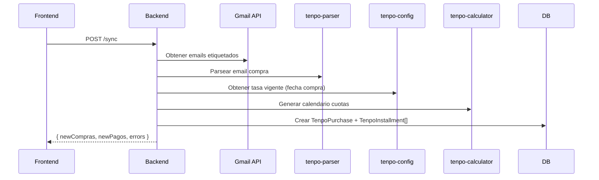
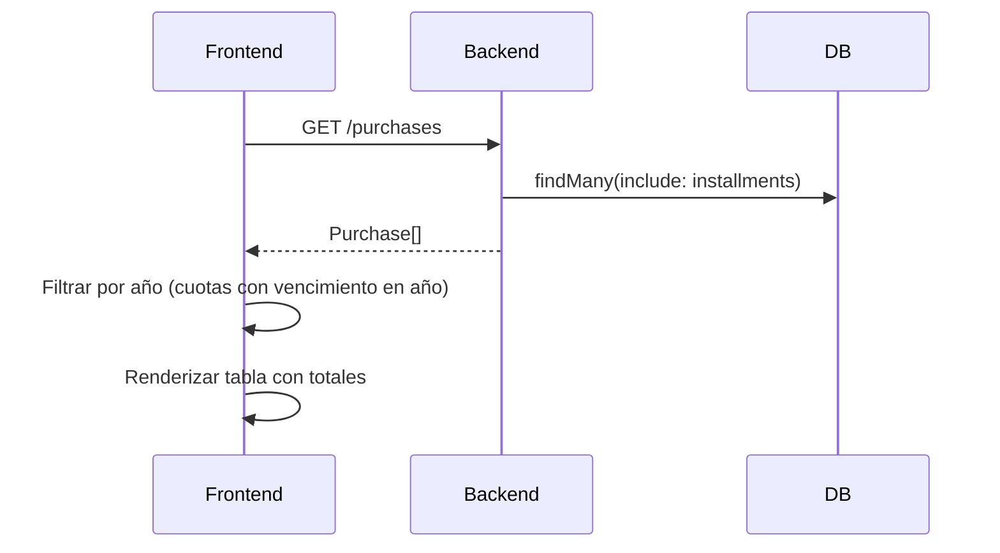
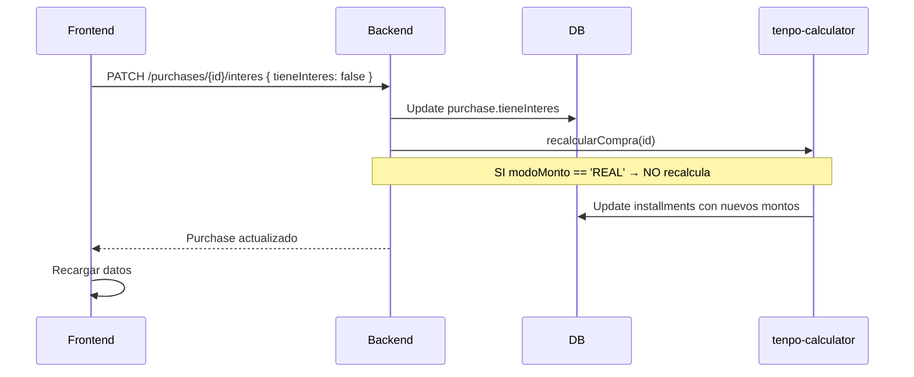
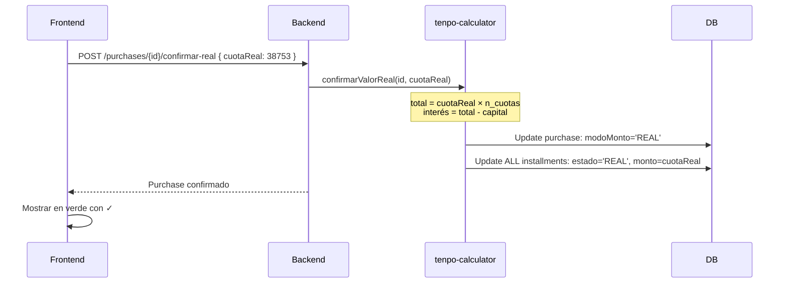

# Auditoría Módulo Tenpo - Backend + Frontend

**Fecha:** 31 de enero de 2026  
**Estado:** 🔍 Auditoría Completa - Sin Implementar Cambios  
**Objetivo:** Identificar puntos de mejora en cálculo de cuotas, persistencia y render de UI

---

## 📁 Mapa de Archivos Involucrados

### Backend

| Archivo | Propósito | Responsabilidad |
|---------|-----------|-----------------|
| **`node-version/src/routes/tenpo.ts`** | API REST endpoints | - Sincronización con Gmail<br>- CRUD de compras y pagos<br>- Configuración de tasas<br>- Toggle interés<br>- Confirmación valor real<br>- Recálculo masivo |
| **`node-version/src/services/tenpo-parser.service.ts`** | Parser de emails | - Extracción de datos de emails<br>- Cálculo de fechas de vencimiento<br>- Lógica de ciclo de facturación |
| **`node-version/src/services/tenpo-calculator.service.ts`** | Cálculo financiero | - Sistema Francés (interés compuesto)<br>- Cuota simple (sin interés)<br>- Recálculo de compras<br>- Confirmación de valor real |
| **`node-version/src/services/tenpo-config.service.ts`** | Gestión de tasas | - Obtener tasa vigente<br>- Historial de tasas<br>- Actualización con cierre automático |
| **`node-version/src/services/gmail.service.ts`** | Integración Gmail | - Autenticación OAuth2<br>- Obtención de emails por etiqueta<br>- Extracción de cuerpo y fecha |

### Frontend

| Archivo | Propósito | Responsabilidad |
|---------|-----------|-----------------|
| **`node-version/client/src/pages/Tenpo.tsx`** | UI principal | - Tabla de compras por año<br>- Desglose mensual<br>- Toggle interés<br>- Modal confirmación valor real<br>- Búsqueda de compras |
| **`node-version/client/src/pages/TenpoConfig.tsx`** | UI configuración | - Gestión de tasas<br>- Historial de cambios<br>- Recálculo masivo |
| **`node-version/client/src/router.tsx`** | Rutas | - `/presupuesto/tenpo`<br>- `/presupuesto/tenpo/config` |
| **`node-version/client/src/components/Sidebar.tsx`** | Navegación | - Link al módulo Tenpo |

### Base de Datos

| Tabla | Propósito | Campos Críticos |
|-------|-----------|-----------------|
| **`tenpo_purchases`** | Compras | - `amountTotalClp` (capital)<br>- `installmentsCount` (n)<br>- `tieneInteres` (boolean)<br>- `modoMonto` (ESTIMADO/REAL)<br>- `totalFinanciadoEstimado` (puede ser REAL)<br>- `interesTotalEstimado` (puede ser REAL) |
| **`tenpo_installments`** | Cuotas | - `baseAmountClp` (monto base)<br>- `finalMonthlyAmountClp` (monto final)<br>- `estado` (ESTIMADO/REAL)<br>- `overrideInterestRate`<br>- `overrideMonthlyAmountClp` |
| **`tenpo_payments`** | Pagos | - `amountClp`<br>- `payDate`<br>- `paymentMethod` |
| **`tenpo_tasa_cuotas`** | Config tasas | - `tasaMensual`<br>- `cae`<br>- `vigenteDesde`<br>- `vigenteHasta` |
| **`tenpo_emails`** | Emails raw | - `gmailMessageId`<br>- `rawBody`<br>- `parsedOk` |

### Documentación

| Archivo | Contenido |
|---------|-----------|
| **`docs/cuotas_interes_fix.md`** | Fix implementado: confirmar valor real |
| **`docs/TENPO_INTEGRATION.md`** | (Posiblemente existe) Integración general |
| **`docs/tenpo_auditoria.md`** | Este documento |

---

## 🔄 Flujo de Datos: API → UI

### 1. Sincronización Inicial (POST /api/tenpo/sync)



**Flujo detallado:**

1. Usuario hace clic en "🔄 Actualizar desde Gmail"
2. Backend busca emails con etiquetas:
   - `Tenpo/Compras TC Tenpo`
   - `Tenpo/Pagos TC Tenpo`
3. Para cada email de compra:
   - Parsea: fecha, comercio, monto, n_cuotas
   - Obtiene tasa vigente a la fecha de compra
   - **Asume `tieneInteres = true` si n_cuotas > 1**
   - Calcula cuotas con **Sistema Francés**
   - Crea registro con `modoMonto = 'ESTIMADO'`

### 2. Carga de Compras (GET /api/tenpo/purchases)



**Proceso de filtrado:**

```typescript
// Frontend filtra compras que tengan AL MENOS una cuota en el año seleccionado
const filteredPurchases = purchasesData.filter((p: any) => {
  return p.installments.some((inst: any) => {
    const dueYear = new Date(inst.dueDate).getFullYear();
    return dueYear === anioSeleccionado;
  });
});
```

### 3. Toggle Interés (PATCH /api/tenpo/purchases/:id/interes)



**Importante:** Si `modoMonto === 'REAL'`, el backend retorna error y NO recalcula.

### 4. Confirmación Valor Real (POST /api/tenpo/purchases/:id/confirmar-real)



**Cálculo crítico:**

```typescript
// NO usa tasa, usa valor confirmado
const totalReal = cuotaReal * purchase.installmentsCount;
const interesReal = totalReal - purchase.amountTotalClp;
```

### 5. Render de Totales en UI

```typescript
// Cálculo en frontend para visualización
const getMonthlyData = (purchaseId: number, month: number) => {
  const purchase = purchases.find(p => p.id === purchaseId);
  
  // Suma cuotas que vencen en el mes seleccionado
  const estimated = purchase.installments
    .filter(inst => {
      const dueDate = new Date(inst.dueDate);
      return dueDate.getFullYear() === anioSeleccionado && 
             dueDate.getMonth() + 1 === month;
    })
    .reduce((sum, inst) => sum + inst.finalMonthlyAmountClp, 0);
  
  return { estimated, paid: 0, gap: estimated };
};
```

**IMPORTANTE:** El frontend **NO recalcula cuotas**, solo suma los valores ya calculados por el backend.

---

## 🚨 Hallazgos y Riesgos Reales

### 1. Asunción de Tasa Mensual Única ⚠️ **CRÍTICO**

**Ubicación:** 
- `tenpo-calculator.service.ts:calcularCuotaFrancesa()`
- `tenpo.ts:POST /sync` (línea 88-92)

**Problema:**

```typescript
// Se asume UNA tasa mensual constante
const tasaMensual = tasaConfig?.tasaMensual || 0.0211; // Fallback 2.11%

const cuota = capital * i / (1 - Math.pow(1 + i, -n));
```

**Riesgo:**
- La tasa puede variar por:
  - **Fecha de compra:** Tenpo puede cambiar tasas en el tiempo
  - **Tipo de comercio:** Algunos comercios tienen tasas preferenciales
  - **Promociones:** Compras "sin interés" (que sí cobran fee al comercio)
  - **Política de Tenpo:** Cambios en modelo de negocio

**Evidencia de problema:**
- Según `cuotas_interes_fix.md`, tasa real observada fue **1,08% mensual** vs **2,11% configurada**
- Error del 0,97% en total financiado

**Impacto:**
- ✅ **Modo REAL:** No hay impacto, valor confirmado prevalece
- ❌ **Modo ESTIMADO:** Sobrestimación de interés → presupuesto inflado

### 2. Sistema Francés vs Modelo Real de Tenpo ⚠️ **CRÍTICO**

**Ubicación:** `tenpo-calculator.service.ts:calcularCuotaFrancesa()`

**Problema:**

```typescript
// Sistema Francés: Interés compuesto
cuota = C × i / (1 − (1 + i)^(-n))

// Pero Tenpo probablemente usa:
// - Interés simple
// - O fee fijo
// - O modelo híbrido
```

**Evidencia:**

| Método | Cuota | Total | Interés |
|--------|-------|-------|---------|
| Sistema Francés (app) | $39.129 | $234.774 | $16.409 |
| Tenpo Real | $38.753 | $232.518 | $14.153 |
| **Diferencia** | **$376** | **$2.256** | **$2.256** |

**Riesgo:**
- Estimaciones iniciales siempre serán incorrectas
- Usuario debe esperar estado de cuenta para saber valor real
- Posible confusión si no se entiende que son estimados

**Mitigación actual:**
- Badge "ESTIMADO" en UI
- Confirmación de valor real disponible
- Modo REAL bloquea recálculo

### 3. Mezcla de "Fee/Recargo" con "Interés" ⚠️ **MEDIO**

**Ubicación:** 
- Toda la lógica asume "interés mensual"
- No hay distinción entre interés y otros cargos

**Problema:**

```typescript
// ¿Qué incluye realmente la "tasa"?
- Interés financiero puro?
- Fee por administración?
- Comisión por uso?
- Seguro de fraude?
- Margen de Tenpo?
```

**Evidencia:**
- Campo `cae` (Carga Anual Equivalente) es informativo pero no se usa en cálculos
- No hay desglose de componentes del costo

**Riesgo:**
- Falta de transparencia en estructura de costos
- Imposible optimizar por componente
- No se puede comparar con otras TC

**Impacto:**
- Bajo: Solo afecta análisis financiero avanzado
- No impacta cálculo si se usa modo REAL

### 4. Recálculo en Frontend vs Backend ⚠️ **BAJO**

**Ubicación:** `Tenpo.tsx:getMonthlyData()`

**Análisis:**

```typescript
// Frontend NO recalcula cuotas
// Solo suma valores ya calculados por backend
const estimated = purchase.installments
  .reduce((sum, inst) => sum + inst.finalMonthlyAmountClp, 0);
```

**Hallazgo:**
- ✅ **CORRECTO:** Frontend solo lee y suma
- ✅ Backend es única fuente de verdad para montos
- ✅ No hay riesgo de inconsistencia

**Excepción:** Frontend calcula totales por mes, pero basado en datos del backend.

### 5. Persistencia de `modoMonto` ✅ **CORRECTO**

**Ubicación:** `schema.prisma` + `tenpo-calculator.service.ts`

**Análisis:**

```prisma
model TenpoPurchase {
  modoMonto String @default("ESTIMADO") // ESTIMADO | REAL
  // ...
}
```

**Comportamiento:**
- ✅ Se persiste correctamente en DB
- ✅ Se respeta en `recalcularCompra()`:
  ```typescript
  if (purchase.modoMonto === 'REAL') {
    console.log(`⏭️  Compra ${purchaseId} en modo REAL, no se recalcula`);
    return purchase;
  }
  ```
- ✅ API retorna error si se intenta toggle interés en modo REAL

**Estado:** No requiere cambios.

### 6. Confusión Semántica de Campos ⚠️ **MEDIO**

**Ubicación:** `schema.prisma`

**Problema:**

```prisma
model TenpoPurchase {
  totalFinanciadoEstimado Float? // ❌ Nombre confunde
  interesTotalEstimado    Float? // ❌ Nombre confunde
  // Cuando modoMonto = 'REAL', estos campos contienen valores REALES, no estimados
}
```

**Riesgo:**
- Desarrolladores futuros pueden asumir que siempre son estimados
- Al leer DB directamente (queries SQL), no es obvio que hay dos estados

**Mitigación actual:**
- Comentarios en código explican comportamiento
- Frontend distingue con colores y badges

**Recomendación futura:**
- Renombrar a `totalFinanciado` e `interesTotal`
- Agregar `esValorConfirmado` boolean para claridad
- Requiere migración de DB

### 7. Falta de Relación Purchase-Payment ⚠️ **ALTO**

**Ubicación:** 
- `schema.prisma`: No hay FK entre `tenpo_purchases` y `tenpo_payments`
- `Tenpo.tsx`: Comentario explica problema

**Problema:**

```typescript
// En Tenpo.tsx (línea 346)
// (En Tenpo no hay relación directa purchase-payment, 
//  así que calculamos proporcionalmente)
const paid = 0; // ❌ No se puede calcular sin relación
```

**Análisis:**
- Emails de pagos NO indican a qué compra corresponden
- Posibles pagos:
  - Pago total del mes (suma de muchas cuotas)
  - Pago parcial
  - Pago de cuotas atrasadas
  - Pago mínimo

**Riesgo:**
- Imposible saber qué cuotas están pagadas
- Campo `paid` siempre es 0
- Campo `gap` es siempre igual a `estimated`
- No se puede marcar cuotas como pagadas

**Impacto:**
- ❌ No hay tracking de pagos por cuota
- ❌ No se puede calcular cobertura real
- ❌ No se puede identificar atrasos

**Posibles soluciones:**
1. Matching heurístico por monto y fecha
2. Permitir asociación manual por usuario
3. Registrar referencias de pago en estado de cuenta

### 8. Fecha de Vencimiento vs Fecha de Pago ⚠️ **BAJO**

**Ubicación:** `tenpo-parser.service.ts:calculateDueDate()`

**Análisis:**

```typescript
// Reglas de cierre y vencimiento
- Cierre: día 21 del mes
- Vencimiento: día 5 del mes siguiente
- Ajuste fin de semana: mover a viernes anterior
```

**Hallazgo:**
- ✅ Lógica correcta para fechas
- ✅ Ajuste de fin de semana implementado
- ⚠️ No considera feriados bancarios

**Riesgo:**
- Menor: Fecha de vencimiento puede caer en feriado
- Tenpo probablemente ajusta automáticamente
- Usuario puede pagar online sin restricción

### 9. Campo `tieneInteres` con Default TRUE ⚠️ **MEDIO**

**Ubicación:** `tenpo.ts:POST /sync` (línea 90)

**Problema:**

```typescript
// Se asume CON interés para n_cuotas > 1
const tieneInteres = parsedPurchase.installmentsCount > 1;
```

**Riesgo:**
- Compras en "cuotas sin interés" (3, 6 o 12 cuotas) se marcan con interés
- Sobrestimación de costos
- Usuario debe manualmente desactivar interés

**Evidencia:**
- Muchos comercios ofrecen "cuotas precio contado"
- Tenpo puede tener promociones sin interés
- Email NO indica si tiene o no interés

**Impacto:**
- Estimación inicial incorrecta para compras sin interés
- Requiere intervención manual

**Posibles mejoras:**
1. Detectar patrones en emails (ej: "sin interés")
2. Aprender de confirmaciones previas
3. Permitir configurar regla por defecto (conservador vs optimista)

### 10. Recálculo Masivo Sin Filtro ⚠️ **BAJO**

**Ubicación:** `tenpo-calculator.service.ts:recalcularTodasEstimadas()`

**Análisis:**

```typescript
// Recalcula TODAS las compras en modo ESTIMADO
// Sin importar antigüedad
const comprasEstimadas = await prisma.tenpoPurchase.findMany({
  where: { modoMonto: 'ESTIMADO' }
});
```

**Riesgo:**
- Compras muy antiguas (ej: 2023) se recalculan innecesariamente
- Pueden tener cuotas ya pagadas pero no confirmadas
- Sobrecarga de procesamiento

**Posible mejora:**
- Filtrar por fecha: solo compras con cuotas futuras
- O solo compras del año actual

---

## 🎯 Lista Priorizada de Cambios Sugeridos

### Prioridad ALTA 🔴

#### 1. Implementar Relación Purchase-Payment
**Problema:** No se puede trackear pagos por cuota  
**Archivo:** `schema.prisma`, nuevas migraciones  
**Estimación:** 8-12 horas  

**Cambios:**

```prisma
model TenpoInstallment {
  // ... campos existentes
  pagos TenpoInstallmentPayment[]
}

model TenpoInstallmentPayment {
  id             Int              @id @default(autoincrement())
  installmentId  Int              @map("installment_id")
  paymentId      Int              @map("payment_id")
  amountClp      Float            @map("amount_clp")
  installment    TenpoInstallment @relation(fields: [installmentId], references: [id])
  payment        TenpoPayment     @relation(fields: [paymentId], references: [id])
  
  @@map("tenpo_installment_payments")
}
```

**Beneficios:**
- Tracking real de pagos
- Cálculo correcto de gap
- Identificación de atrasos
- Proyección de cobertura

#### 2. Mejorar Modelo de Estimación de Interés
**Problema:** Sistema Francés sobrestima consistentemente  
**Archivo:** `tenpo-calculator.service.ts`  
**Estimación:** 4-6 horas  

**Opciones:**

```typescript
// Opción A: Interés simple
calcularCuotaTenpoSimple(capital: number, nCuotas: number, tasaMensual: number) {
  const interesTotal = Math.round(capital * tasaMensual * nCuotas);
  const totalFinanciado = capital + interesTotal;
  return Math.round(totalFinanciado / nCuotas);
}

// Opción B: Factor de ajuste empírico
calcularCuotaTenpoAjustada(capital: number, nCuotas: number, tasaMensual: number) {
  const cuotaFrancesa = this.calcularCuotaFrancesa(capital, nCuotas, tasaMensual);
  const factorAjuste = 0.95; // Basado en datos históricos
  return Math.round(cuotaFrancesa * factorAjuste);
}

// Opción C: Aprendizaje de datos reales
async calcularCuotaConHistorial(capital: number, nCuotas: number, tasaMensual: number) {
  // Buscar compras similares confirmadas
  const similares = await this.buscarComprasSimilares(capital, nCuotas);
  if (similares.length > 0) {
    // Calcular tasa real promedio implícita
    const tasaRealPromedio = this.calcularTasaImplicita(similares);
    return this.calcularCuotaFrancesa(capital, nCuotas, tasaRealPromedio);
  }
  // Fallback a método actual
  return this.calcularCuotaFrancesa(capital, nCuotas, tasaMensual);
}
```

**Beneficios:**
- Estimaciones más precisas
- Menos sorpresas al ver estado de cuenta
- Mejor planificación financiera

### Prioridad MEDIA 🟡

#### 3. Renombrar Campos para Claridad Semántica
**Problema:** `totalFinanciadoEstimado` contiene valores reales cuando `modoMonto='REAL'`  
**Archivo:** `schema.prisma`, migración, todos los servicios  
**Estimación:** 6-8 horas  

**Cambios:**

```prisma
model TenpoPurchase {
  totalFinanciado Float? @map("total_financiado") // Era: totalFinanciadoEstimado
  interesTotal    Float? @map("interes_total")    // Era: interesTotalEstimado
  esConfirmado    Boolean @default(false) @map("es_confirmado") // Redundante con modoMonto pero más claro
}
```

**Impacto:**
- Requiere migración de datos (renombrar columnas)
- Actualizar todos los accesos en backend
- Actualizar frontend

**Beneficios:**
- Código más legible
- Menos confusión para desarrolladores

#### 4. Detección Automática de "Sin Interés"
**Problema:** Se asume interés para toda compra con n_cuotas > 1  
**Archivo:** `tenpo-parser.service.ts`, `tenpo.ts`  
**Estimación:** 3-4 horas  

**Implementación:**

```typescript
parsePurchaseEmail(body: string): ParsedPurchase | null {
  // ... parsing existente
  
  // Detectar patrones de "sin interés"
  const sinInteres = /sin\s+inter[ée]s|cuotas\s+precio\s+contado|0%/i.test(body);
  
  return {
    // ... campos existentes
    tieneInteresSugerido: !sinInteres
  };
}

// En sync:
const tieneInteres = parsedPurchase.tieneInteresSugerido ?? 
                     (parsedPurchase.installmentsCount > 1);
```

**Beneficios:**
- Menos intervención manual
- Estimaciones iniciales más precisas

#### 5. Filtrar Recálculo Masivo por Antigüedad
**Problema:** Recalcula compras muy antiguas innecesariamente  
**Archivo:** `tenpo-calculator.service.ts`  
**Estimación:** 1-2 horas  

**Cambios:**

```typescript
async recalcularTodasEstimadas(soloFuturas: boolean = true) {
  let where: any = { modoMonto: 'ESTIMADO' };
  
  if (soloFuturas) {
    // Solo compras con cuotas que vencen en el futuro
    const now = new Date();
    where.installments = {
      some: {
        dueDate: { gte: now }
      }
    };
  }
  
  const comprasEstimadas = await prisma.tenpoPurchase.findMany({ 
    where,
    include: { installments: true }
  });
  
  // ... resto del proceso
}
```

**Beneficios:**
- Menor carga de procesamiento
- Más rápido al cambiar tasa

### Prioridad BAJA 🟢

#### 6. Considerar Feriados en Fecha de Vencimiento
**Problema:** Ajuste de fin de semana no considera feriados  
**Archivo:** `tenpo-parser.service.ts`  
**Estimación:** 2-3 horas  

**Implementación:**

```typescript
// Usar librería de feriados chilenos
import { esFeriado } from 'chile-feriados';

calculateDueDate(purchaseDate: Date): Date {
  // ... cálculo existente
  let dueDate = setDate(addMonths(billMonth, 1), 5);

  // Ajustar por fin de semana Y feriados
  while (isSaturday(dueDate) || isSunday(dueDate) || esFeriado(dueDate)) {
    dueDate = subDays(dueDate, 1);
  }

  return dueDate;
}
```

**Beneficios:**
- Fechas más precisas
- Menor: Tenpo probablemente ajusta automáticamente

#### 7. Desglose de Componentes de Costo
**Problema:** No se distingue entre interés, fee, seguro, etc.  
**Archivo:** `schema.prisma`, servicios  
**Estimación:** 8-10 horas  

**Cambios:**

```prisma
model TenpoPurchase {
  // ... campos existentes
  interesFinanciero   Float? @map("interes_financiero")
  feeAdministracion   Float? @map("fee_administracion")
  seguroFraude        Float? @map("seguro_fraude")
  otrosCargos         Float? @map("otros_cargos")
}
```

**Nota:** Requiere información que probablemente no está en emails.

**Beneficios:**
- Análisis financiero más detallado
- Comparación con otras TC
- Optimización de costos

#### 8. Historial de Tasas Reales Observadas
**Problema:** No se aprende de confirmaciones previas  
**Archivo:** Nueva tabla, nuevo servicio  
**Estimación:** 6-8 horas  

**Implementación:**

```prisma
model TenpoTasaRealObservada {
  id                Int      @id @default(autoincrement())
  purchaseId        Int      @map("purchase_id")
  fechaCompra       DateTime @map("fecha_compra")
  nCuotas           Int      @map("n_cuotas")
  capitalClp        Float    @map("capital_clp")
  cuotaReal         Float    @map("cuota_real")
  tasaImplicita     Float    @map("tasa_implicita") // Calculada
  createdAt         DateTime @default(now()) @map("created_at")
  
  @@map("tenpo_tasas_reales_observadas")
}
```

**Servicio:**

```typescript
async aprenderDeTasaReal(purchaseId: number, cuotaReal: number) {
  const purchase = await prisma.tenpoPurchase.findUnique({
    where: { id: purchaseId }
  });
  
  // Calcular tasa implícita
  const tasaImplicita = this.calcularTasaImplicita(
    purchase.amountTotalClp,
    purchase.installmentsCount,
    cuotaReal
  );
  
  // Guardar observación
  await prisma.tenpoTasaRealObservada.create({
    data: {
      purchaseId,
      fechaCompra: purchase.purchaseDate,
      nCuotas: purchase.installmentsCount,
      capitalClp: purchase.amountTotalClp,
      cuotaReal,
      tasaImplicita
    }
  });
}
```

**Beneficios:**
- Mejora continua de estimaciones
- Detección de patrones por periodo
- Análisis de tendencias de tasas

---

## 📊 Resumen de Riesgos

| Riesgo | Prioridad | Impacto Actual | Mitigación Actual |
|--------|-----------|----------------|-------------------|
| Sistema Francés sobrestima | 🔴 ALTA | Estimaciones infladas 0.5-2% | Usuario confirma valor real |
| Tasa única asumida | 🔴 ALTA | No refleja variaciones reales | Tasa configurable + confirmación |
| Sin relación purchase-payment | 🔴 ALTA | No se puede trackear pagos | Ninguna (gap faltante) |
| Campo `tieneInteres` default TRUE | 🟡 MEDIA | Sobrestima compras sin interés | Toggle manual disponible |
| Confusión semántica de campos | 🟡 MEDIA | Código menos legible | Comentarios explicativos |
| Recálculo masivo sin filtro | 🟢 BAJA | Procesamiento innecesario | Tiempo de ejecución aceptable |
| No considera feriados | 🟢 BAJA | Fechas imprecisas (raro) | Tenpo ajusta automáticamente |

---

## ✅ Lo Que Funciona Bien (No Cambiar)

1. **Persistencia de `modoMonto`:** Correcta y respetada en recálculos
2. **Frontend NO recalcula:** Solo lee datos del backend (única fuente de verdad)
3. **Confirmación de valor real:** Bloquea recálculo automático correctamente
4. **Cálculo de fechas de vencimiento:** Lógica correcta con ajuste de fin de semana
5. **Gestión de tasas históricas:** Modelo con vigencia temporal bien diseñado
6. **UI visual clara:** Badges ESTIMADO/CONFIRMADO, colores distintivos
7. **Sincronización Gmail:** Robusta con manejo de errores
8. **Filtrado por año en UI:** Permite ver compras con cuotas en año seleccionado

---

## 🎯 Recomendación de Implementación

### Fase 1: Crítico (Sprint 1-2 semanas)
1. ✅ Implementar relación Purchase-Payment (tracking de pagos)
2. ✅ Mejorar modelo de estimación (reducir error)

### Fase 2: Mejora de UX (Sprint 2-4 semanas)
3. ✅ Renombrar campos para claridad
4. ✅ Detección automática "sin interés"
5. ✅ Filtrar recálculo masivo

### Fase 3: Optimización (Backlog)
6. ⏳ Considerar feriados
7. ⏳ Desglose de costos (si se obtiene información)
8. ⏳ Historial de tasas observadas (ML básico)

---

## 📝 Notas Finales

- **No hacer cambios todavía:** Este es un documento de auditoría
- **Validar con usuario:** Confirmar prioridades antes de implementar
- **Migración de datos:** Fase 2 requiere migración, planificar downtime
- **Tests:** Añadir tests unitarios para cálculos financieros
- **Documentación:** Actualizar `TENPO_INTEGRATION.md` con cambios

---

**Siguiente Paso:** Discutir hallazgos y aprobar cambios prioritarios antes de implementar.
