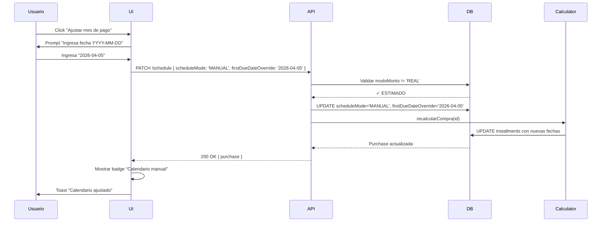
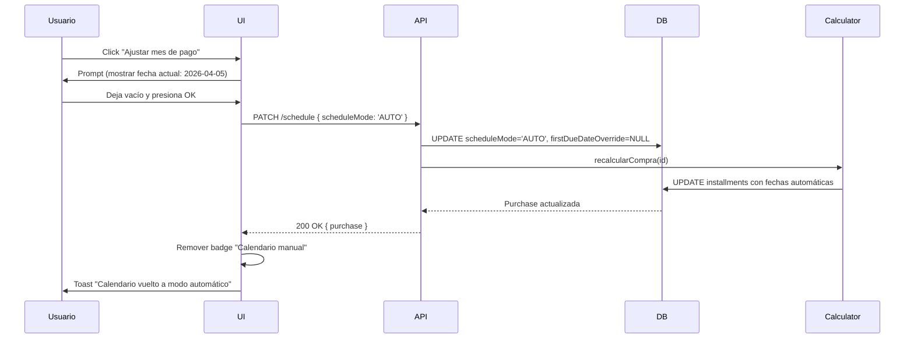
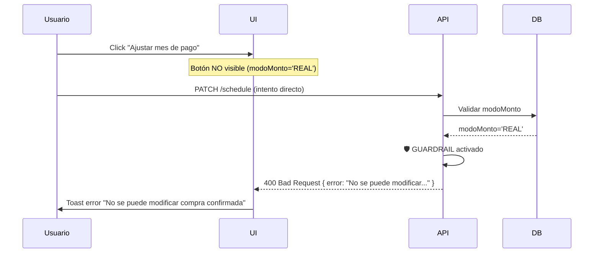
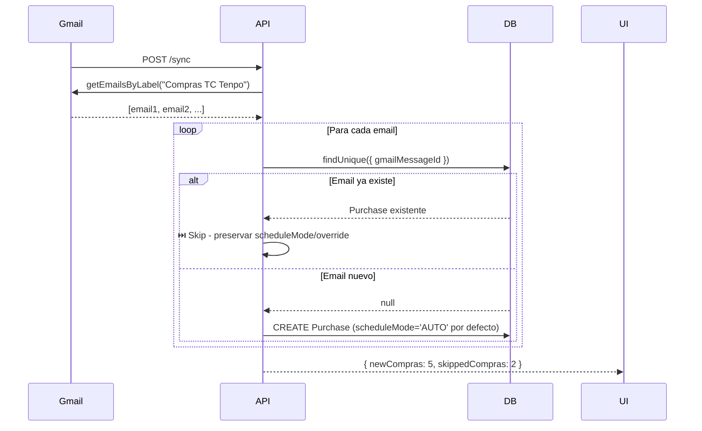

# Calendar Override - Ajuste Manual de Fechas de Cuotas Tenpo

**Fecha:** 1 febrero 2026  
**Versión:** 1.0  
**Autor:** Sistema  
**Estado:** ✅ IMPLEMENTADO

---

## 📋 Resumen Ejecutivo

Se implementó **Calendar Override** para permitir ajustar manualmente la fecha de inicio del pago de cuotas cuando no coincide con la fecha automática calculada.

**Problema resuelto:**
> Una compra realizada en enero (día 25) normalmente genera primera cuota para febrero. Pero si el ciclo de facturación bancario cierra después de la compra, la primera cuota real puede ser en marzo. Calendar Override permite ajustar esto manualmente.

**Características clave:**
- 📅 Override persiste en DB (no se pierde con sync/import)
- 🛡️ Respeta guardrails REAL (no modifica compras confirmadas)
- 🔄 Recalcula fechas de todas las cuotas automáticamente
- 🎨 UI simple con date picker via prompt
- ♻️ Reversible (puede volver a modo AUTO)

---

## 🎯 Casos de Uso

### Caso 1: Compra Fin de Mes

**Escenario:**
- Compra: 28 enero 2026
- Cierre TC: 21 febrero 2026
- Primera cuota calculada: 5 marzo 2026 (AUTO)
- Primera cuota real: 5 abril 2026 (banco la movió un mes)

**Solución:**
1. Abrir compra en UI
2. Click "📅 Ajustar mes de pago"
3. Ingresar: `2026-04-05`
4. Sistema recalcula todas las fechas desde abril

---

### Caso 2: Compra Durante Viaje

**Escenario:**
- Compra: 10 diciembre 2025 (en el extranjero)
- Procesamiento banco: 15 diciembre 2025
- Primera cuota calculada: 5 enero 2026 (AUTO)
- Primera cuota real: 5 febrero 2026 (diferencia por procesamiento internacional)

**Solución:**
- Ajustar override a `2026-02-05`
- Calendario se ajusta: feb, mar, abr, may, jun (si 5 cuotas)

---

### Caso 3: Compra con Cuotas Diferidas

**Escenario:**
- Compra: 15 noviembre 2025 (Black Friday)
- Promoción: "3 meses sin pagar"
- Primera cuota calculada: 5 diciembre 2025 (AUTO)
- Primera cuota real: 5 febrero 2026 (diferida por promoción)

**Solución:**
- Ajustar override a `2026-02-05`
- El interés se calcula sobre todas las cuotas (TenpoAddOnV1 no cambia)

---

## 🔧 Implementación Técnica

### 1. Modelo de Datos (Prisma Schema)

```prisma
model TenpoPurchase {
  id                        Int                @id @default(autoincrement())
  // ... campos existentes ...
  scheduleMode              String             @default("AUTO") @map("schedule_mode") // AUTO | MANUAL
  firstDueDateOverride      DateTime?          @map("first_due_date_override") // Override fecha primera cuota
  // ... resto de campos ...
}
```

**Campos nuevos:**

| Campo | Tipo | Default | Nullable | Descripción |
|-------|------|---------|----------|-------------|
| `scheduleMode` | String | `'AUTO'` | No | Modo del calendario: `'AUTO'` (calculado) o `'MANUAL'` (override) |
| `firstDueDateOverride` | DateTime | `null` | Sí | Fecha de primera cuota cuando `scheduleMode='MANUAL'` |

**Migración aplicada:**
```bash
npx prisma migrate dev --name add_calendar_override
```

---

### 2. Servicio de Cálculo (tenpo-calculator.service.ts)

**Modificación en `recalcularCompra()`:**

```typescript
// Determinar fecha primera cuota: usar override si scheduleMode='MANUAL'
let primeraFechaVencimiento: Date;
if (purchase.scheduleMode === 'MANUAL' && purchase.firstDueDateOverride) {
  primeraFechaVencimiento = purchase.firstDueDateOverride;
  console.log(`📅 [CALENDAR OVERRIDE] Compra ${purchaseId} usa fecha manual: ${primeraFechaVencimiento.toISOString().split('T')[0]}`);
} else {
  primeraFechaVencimiento = purchase.installments[0]?.dueDate || new Date();
}

// Generar calendario con fee si aplica
const { cuotas, totalFinanciado, interesTotal } = this.generarCalendarioCuotas(
  purchase.amountTotalClp,
  purchase.installmentsCount,
  primeraFechaVencimiento,  // ← Usa override si aplica
  purchase.tieneInteres,
  tasaMensual,
  feePct
);

// Actualizar cada installment con fechas recalculadas
for (let i = 0; i < purchase.installments.length; i++) {
  const installment = purchase.installments[i];
  const nuevaFecha = addMonths(primeraFechaVencimiento, i); // ← Calcula desde override
  
  await prisma.tenpoInstallment.update({
    where: { id: installment.id },
    data: {
      baseAmountClp: cuotas[i],
      finalMonthlyAmountClp: cuotas[i],
      dueDate: nuevaFecha,           // ← Actualiza fecha
      payDateEstimated: nuevaFecha,  // ← Actualiza fecha estimada
      estado: 'ESTIMADO'
    }
  });
}
```

**Comportamiento:**
- Si `scheduleMode='AUTO'` → usa fecha existente en installments
- Si `scheduleMode='MANUAL'` → usa `firstDueDateOverride` y recalcula todas las cuotas desde ahí

**Log esperado:**
```
📅 [CALENDAR OVERRIDE] Compra 123 usa fecha manual: 2026-04-05
✅ Compra 123 recalculada: 6 cuotas, Total: $232,518
```

---

### 3. API Endpoint (tenpo.ts)

**Nuevo endpoint:**

```typescript
/**
 * PATCH /api/tenpo/purchases/:id/schedule
 * Configura override de calendario para primera cuota
 * 
 * Body:
 * - scheduleMode: 'AUTO' | 'MANUAL'
 * - firstDueDateOverride?: string (ISO date, solo si scheduleMode='MANUAL')
 * 
 * GUARDRAIL: No permite modificar compras en modo REAL
 */
router.patch('/purchases/:id/schedule', async (req, res) => {
  const { id } = req.params;
  const { scheduleMode, firstDueDateOverride } = req.body;

  try {
    // Validar scheduleMode
    if (!scheduleMode || !['AUTO', 'MANUAL'].includes(scheduleMode)) {
      return res.status(400).json({ 
        error: 'scheduleMode debe ser "AUTO" o "MANUAL"' 
      });
    }

    // Validar que si es MANUAL, debe proveer firstDueDateOverride
    if (scheduleMode === 'MANUAL' && !firstDueDateOverride) {
      return res.status(400).json({ 
        error: 'scheduleMode "MANUAL" requiere firstDueDateOverride' 
      });
    }

    // Obtener compra actual
    const purchase = await prisma.tenpoPurchase.findUnique({
      where: { id: parseInt(id) }
    });

    if (!purchase) {
      return res.status(404).json({ error: 'Compra no encontrada' });
    }

    // GUARDRAIL: No modificar si está en modo REAL
    if (purchase.modoMonto === 'REAL') {
      console.log(`🛡️  [GUARDRAIL] Intento de modificar schedule en compra REAL bloqueado`);
      console.log(`    Compra ID: ${id}, Merchant: ${purchase.merchant}`);
      return res.status(400).json({ 
        error: 'No se puede modificar calendario de compra en modo REAL. Los valores fueron confirmados con el banco.' 
      });
    }

    // Actualizar scheduleMode y override
    const updateData: any = { scheduleMode };
    
    if (scheduleMode === 'MANUAL' && firstDueDateOverride) {
      updateData.firstDueDateOverride = new Date(firstDueDateOverride);
      console.log(`📅 [CALENDAR OVERRIDE] Configurando override para compra ${id}: ${firstDueDateOverride}`);
    } else if (scheduleMode === 'AUTO') {
      // Si vuelve a AUTO, limpiar override
      updateData.firstDueDateOverride = null;
      console.log(`📅 [CALENDAR OVERRIDE] Limpiando override para compra ${id} (modo AUTO)`);
    }

    await prisma.tenpoPurchase.update({
      where: { id: parseInt(id) },
      data: updateData
    });

    // Recalcular compra para aplicar nuevo calendario
    const updatedPurchase = await tenpoCalculatorService.recalcularCompra(parseInt(id));

    res.json(updatedPurchase);

  } catch (error: any) {
    console.error('Error actualizando schedule:', error);
    res.status(500).json({ error: error.message });
  }
});
```

**Ejemplos de uso:**

**Activar modo MANUAL:**
```http
PATCH /api/tenpo/purchases/123/schedule
Content-Type: application/json

{
  "scheduleMode": "MANUAL",
  "firstDueDateOverride": "2026-04-05"
}
```

**Respuesta:**
```http
HTTP/1.1 200 OK
Content-Type: application/json

{
  "id": 123,
  "merchant": "Amazon",
  "scheduleMode": "MANUAL",
  "firstDueDateOverride": "2026-04-05T00:00:00.000Z",
  "installments": [
    { "installmentNumber": 1, "dueDate": "2026-04-05", ... },
    { "installmentNumber": 2, "dueDate": "2026-05-05", ... },
    { "installmentNumber": 3, "dueDate": "2026-06-05", ... }
  ]
}
```

**Volver a modo AUTO:**
```http
PATCH /api/tenpo/purchases/123/schedule
Content-Type: application/json

{
  "scheduleMode": "AUTO"
}
```

**Intentar modificar compra REAL:**
```http
PATCH /api/tenpo/purchases/456/schedule
Content-Type: application/json

{
  "scheduleMode": "MANUAL",
  "firstDueDateOverride": "2026-05-05"
}
```

**Respuesta:**
```http
HTTP/1.1 400 Bad Request
Content-Type: application/json

{
  "error": "No se puede modificar calendario de compra en modo REAL. Los valores fueron confirmados con el banco."
}
```

**Log de guardrail:**
```
🛡️  [GUARDRAIL] Intento de modificar schedule en compra REAL bloqueado
    Compra ID: 456, Merchant: Mercado Libre
```

---

### 4. Protección en Sync (tenpo.ts - POST /sync)

**Modificación:**

```typescript
// Verificar si ya existe
const exists = await prisma.tenpoEmail.findUnique({
  where: { gmailMessageId }
});

if (exists) {
  skippedCompras++;
  console.log(`⏭️  Compra ya sincronizada (gmailMessageId: ${gmailMessageId}) - preservando scheduleMode y override`);
  continue; // ← NO actualiza, NO toca scheduleMode ni firstDueDateOverride
}
```

**Comportamiento:**
- Sync solo **crea** compras nuevas
- Compras existentes se **saltan completamente**
- `scheduleMode` y `firstDueDateOverride` **nunca** se sobrescriben

**Razón:**
> Si una compra ya existe en DB, significa que el usuario ya la configuró (posiblemente con override manual). El sync debe respetar esa configuración y no pisarla con valores automáticos.

**Log esperado:**
```
📧 Buscando emails con etiqueta: Tenpo/Compras TC Tenpo
✅ Encontrados 10 mensajes de compras
⏭️  Compra ya sincronizada (gmailMessageId: abc123) - preservando scheduleMode y override
⏭️  Compra ya sincronizada (gmailMessageId: def456) - preservando scheduleMode y override
📊 Resumen: 8 compras nuevas (2 ya existían), 0 pagos nuevos (0 ya existían)
```

---

### 5. Frontend (Tenpo.tsx)

**Interface actualizada:**

```typescript
interface Purchase {
  // ... campos existentes ...
  scheduleMode?: 'AUTO' | 'MANUAL';
  firstDueDateOverride?: string | null;
  // ... resto ...
}
```

**UI - Botón de ajuste:**

```tsx
{purchase.modoMonto === 'ESTIMADO' && (
  <>
    <button onClick={() => handleAdjustSchedule(purchase.id)}>
      📅 Ajustar mes de pago
    </button>

    {purchase.scheduleMode === 'MANUAL' && purchase.firstDueDateOverride && (
      <span style={{ /* badge styles */ }}>
        📅 Calendario manual (desde {format(new Date(purchase.firstDueDateOverride), 'MMM yyyy', { locale: es })})
      </span>
    )}
  </>
)}
```

**Handler de ajuste:**

```typescript
const handleAdjustSchedule = async (purchaseId: number) => {
  const purchase = purchases.find(p => p.id === purchaseId);
  if (!purchase) return;

  const currentOverride = purchase.firstDueDateOverride 
    ? new Date(purchase.firstDueDateOverride).toISOString().split('T')[0]
    : '';

  const newDate = prompt(
    'Ingresa la fecha de la primera cuota (YYYY-MM-DD):\n\n' +
    'Ejemplo: 2026-03-05\n' +
    (currentOverride ? `Fecha actual: ${currentOverride}\n` : '') +
    'Deja vacío para volver a modo automático',
    currentOverride
  );

  // Usuario canceló
  if (newDate === null) return;

  // Usuario quiere volver a AUTO (string vacío)
  if (newDate.trim() === '') {
    try {
      const response = await fetch(`http://localhost:3000/api/tenpo/purchases/${purchaseId}/schedule`, {
        method: 'PATCH',
        headers: { 'Content-Type': 'application/json' },
        body: JSON.stringify({ scheduleMode: 'AUTO' })
      });

      if (!response.ok) throw new Error('Error al cambiar calendario');

      setToast({ message: 'Calendario vuelto a modo automático', type: 'success' });
      await loadData();
      return;
    } catch (error: any) {
      setToast({ message: error.message, type: 'error' });
      return;
    }
  }

  // Validar formato de fecha
  const dateRegex = /^\d{4}-\d{2}-\d{2}$/;
  if (!dateRegex.test(newDate)) {
    setToast({ message: 'Formato de fecha inválido. Usa YYYY-MM-DD', type: 'error' });
    return;
  }

  // Usuario ingresó nueva fecha
  try {
    const response = await fetch(`http://localhost:3000/api/tenpo/purchases/${purchaseId}/schedule`, {
      method: 'PATCH',
      headers: { 'Content-Type': 'application/json' },
      body: JSON.stringify({ 
        scheduleMode: 'MANUAL',
        firstDueDateOverride: newDate
      })
    });

    if (!response.ok) throw new Error('Error al cambiar calendario');

    setToast({ 
      message: 'Calendario ajustado - Las cuotas se recalcularon con la nueva fecha', 
      type: 'success' 
    });
    
    await loadData();
  } catch (error: any) {
    setToast({ message: error.message, type: 'error' });
  }
};
```

**Flujo UI:**

1. Usuario expande compra ESTIMADO
2. Ve botón "📅 Ajustar mes de pago" (solo si ESTIMADO)
3. Click → aparece prompt con instrucciones
4. Ingresa fecha `2026-04-05` (o deja vacío para AUTO)
5. Sistema valida formato
6. Llama API `/schedule` con PATCH
7. API recalcula todas las fechas
8. UI recarga y muestra badge "📅 Calendario manual"

**Ejemplo visual:**

```
┌─────────────────────────────────────────────────────────┐
│ ▼ Amazon                              6 cuotas ESTIMADO │
│   Fecha: 25 enero 2026                3 cuotas          │
│                                                          │
│ ☑ Con interés (2.11%)                                   │
│ [✓ Confirmar valor real]  [📅 Ajustar mes de pago]     │
│ 📅 Calendario manual (desde abr 2026)  ← Badge          │
│                                                          │
│ Capital: $218,365                                        │
│ Comisión (2%): +$4,367                                   │
│ Interés por cuotas: +$9,786                              │
│ Total financiado: $232,518                               │
└─────────────────────────────────────────────────────────┘
```

---

## 🛡️ Guardrails y Validaciones

### 1. Guardrail de Modo REAL

**Ubicación:** `PATCH /api/tenpo/purchases/:id/schedule`

**Validación:**
```typescript
if (purchase.modoMonto === 'REAL') {
  console.log(`🛡️  [GUARDRAIL] Intento de modificar schedule en compra REAL bloqueado`);
  return res.status(400).json({ 
    error: 'No se puede modificar calendario de compra en modo REAL.' 
  });
}
```

**Razón:**
> Compras REAL tienen fechas confirmadas del banco. Modificar el calendario sobrescribiría datos reales con cálculos, lo cual viola la integridad del sistema.

---

### 2. Validación de Formato de Fecha

**Ubicación:** Frontend `handleAdjustSchedule()`

**Validación:**
```typescript
const dateRegex = /^\d{4}-\d{2}-\d{2}$/;
if (!dateRegex.test(newDate)) {
  setToast({ message: 'Formato de fecha inválido. Usa YYYY-MM-DD', type: 'error' });
  return;
}
```

**Formato esperado:** `YYYY-MM-DD` (ISO 8601)

**Ejemplos válidos:**
- `2026-03-05`
- `2026-12-21`
- `2027-01-15`

**Ejemplos inválidos:**
- `05-03-2026` ❌
- `2026/03/05` ❌
- `marzo 5, 2026` ❌

---

### 3. Validación de scheduleMode

**Ubicación:** `PATCH /api/tenpo/purchases/:id/schedule`

**Validación:**
```typescript
if (!scheduleMode || !['AUTO', 'MANUAL'].includes(scheduleMode)) {
  return res.status(400).json({ 
    error: 'scheduleMode debe ser "AUTO" o "MANUAL"' 
  });
}

if (scheduleMode === 'MANUAL' && !firstDueDateOverride) {
  return res.status(400).json({ 
    error: 'scheduleMode "MANUAL" requiere firstDueDateOverride' 
  });
}
```

**Reglas:**
- `scheduleMode` es obligatorio
- Valores permitidos: `'AUTO'` o `'MANUAL'`
- Si `'MANUAL'` → debe proveer `firstDueDateOverride`
- Si `'AUTO'` → `firstDueDateOverride` se limpia (null)

---

### 4. Protección en Sync

**Ubicación:** `POST /api/tenpo/sync`

**Validación:**
```typescript
const exists = await prisma.tenpoEmail.findUnique({
  where: { gmailMessageId }
});

if (exists) {
  skippedCompras++;
  console.log(`⏭️  Compra ya sincronizada - preservando scheduleMode y override`);
  continue; // ← NO actualiza nada
}
```

**Comportamiento:**
- Sync **solo crea** nuevas compras
- Compras existentes se **saltan**
- **Nunca** sobrescribe `scheduleMode` ni `firstDueDateOverride`

---

## 📊 Matriz de Estados

| scheduleMode | firstDueDateOverride | Comportamiento | UI Badge |
|--------------|---------------------|----------------|----------|
| `'AUTO'` | `null` | Usa fecha calculada automáticamente | Sin badge |
| `'MANUAL'` | `2026-04-05` | Usa fecha override, recalcula cuotas | 📅 Calendario manual (desde abr 2026) |
| `'MANUAL'` | `null` | ⚠️ Inválido - API rechaza con 400 | N/A |
| `'AUTO'` | `2026-04-05` | Ignora override, usa fecha automática | Sin badge |

**Estado inicial de compras nuevas:**
- `scheduleMode`: `'AUTO'` (default)
- `firstDueDateOverride`: `null`

---

## 🔄 Flujos de Interacción

### Flujo 1: Activar Override



---

### Flujo 2: Desactivar Override (volver a AUTO)



---

### Flujo 3: Intento de Override en REAL (bloqueado)



---

### Flujo 4: Sync respeta Override



---

## 🧪 Casos de Prueba

### Test 1: Activar Override en Compra ESTIMADO

**Setup:**
```sql
INSERT INTO tenpo_purchases (id, merchant, modoMonto, scheduleMode, firstDueDateOverride)
VALUES (100, 'Test Merchant', 'ESTIMADO', 'AUTO', NULL);
```

**Request:**
```http
PATCH /api/tenpo/purchases/100/schedule
Content-Type: application/json

{
  "scheduleMode": "MANUAL",
  "firstDueDateOverride": "2026-05-15"
}
```

**Expected:**
- HTTP 200 OK
- `scheduleMode` = `'MANUAL'`
- `firstDueDateOverride` = `2026-05-15T00:00:00.000Z`
- Cuotas recalculadas con fechas: 2026-05-15, 2026-06-15, 2026-07-15, ...

---

### Test 2: Intentar Override en Compra REAL

**Setup:**
```sql
INSERT INTO tenpo_purchases (id, merchant, modoMonto, scheduleMode)
VALUES (200, 'Real Merchant', 'REAL', 'AUTO');
```

**Request:**
```http
PATCH /api/tenpo/purchases/200/schedule
Content-Type: application/json

{
  "scheduleMode": "MANUAL",
  "firstDueDateOverride": "2026-06-01"
}
```

**Expected:**
- HTTP 400 Bad Request
- Error: `"No se puede modificar calendario de compra en modo REAL..."`
- Log: `🛡️ [GUARDRAIL] Intento de modificar schedule en compra REAL bloqueado`
- DB sin cambios

---

### Test 3: Volver a Modo AUTO

**Setup:**
```sql
UPDATE tenpo_purchases 
SET scheduleMode = 'MANUAL', firstDueDateOverride = '2026-07-01'
WHERE id = 300;
```

**Request:**
```http
PATCH /api/tenpo/purchases/300/schedule
Content-Type: application/json

{
  "scheduleMode": "AUTO"
}
```

**Expected:**
- HTTP 200 OK
- `scheduleMode` = `'AUTO'`
- `firstDueDateOverride` = `null`
- Cuotas recalculadas con fechas automáticas (desde purchaseDate + 1 mes)

---

### Test 4: Sync Preserva Override

**Setup:**
```sql
INSERT INTO tenpo_purchases (id, emailId, scheduleMode, firstDueDateOverride)
VALUES (400, 1, 'MANUAL', '2026-08-01');

INSERT INTO tenpo_emails (id, gmailMessageId)
VALUES (1, 'gmail_msg_123');
```

**Acción:**
```bash
POST /api/tenpo/sync
```

**Expected:**
- Compra 400 se **salta** (gmailMessageId ya existe)
- `scheduleMode` sigue siendo `'MANUAL'`
- `firstDueDateOverride` sigue siendo `2026-08-01`
- Log: `⏭️ Compra ya sincronizada (gmailMessageId: gmail_msg_123) - preservando scheduleMode y override`

---

## 📝 Notas Técnicas

### Por qué separar scheduleMode y firstDueDateOverride

**Opción rechazada:**
```prisma
firstDueDateOverride DateTime? // ← Si es null → AUTO, si tiene valor → MANUAL
```

**Problema:**
- No se puede distinguir entre "nunca configurado" vs "volvió a AUTO después de usar MANUAL"
- Dificulta auditoría y debugging

**Opción elegida:**
```prisma
scheduleMode String @default("AUTO")
firstDueDateOverride DateTime?
```

**Beneficios:**
- Estado explícito en `scheduleMode`
- `firstDueDateOverride` puede tener valor histórico incluso en modo AUTO
- Fácil de auditar: "¿usuario alguna vez usó override?"

---

### Por qué usar prompt() en lugar de modal

**Prompt:**
- ✅ Simple y rápido
- ✅ Validación en frontend
- ✅ No requiere estado adicional en React

**Modal dedicado:**
- ❌ Más código (useState, componente Modal)
- ❌ Más complejo para calendario date picker
- ✅ Mejor UX (pero overkill para este caso)

**Decisión:** Prompt para MVP. Si se necesita mejor UX, migrar a modal con date picker.

---

### Interacción con TenpoAddOnV1

**Pregunta:** ¿El override afecta el cálculo de interés?

**Respuesta:** NO. El interés se calcula sobre:
- Base financiada: `capital + fee`
- Número de cuotas: `n`
- Tasa mensual: `tasaMensual`

La fecha de las cuotas **no afecta** el monto de interés. Solo afecta **cuándo** se pagan.

**Fórmula TenpoAddOnV1:**
```javascript
interesTotal = round(financedBaseClp × tasaMensual × n)
```

Sin importar si las fechas son:
- Caso A: feb, mar, abr, may, jun, jul
- Caso B: abr, may, jun, jul, ago, sep

El interés total es **el mismo**.

---

### Interacción con feePct y metadata

**Pregunta:** ¿El override afecta el fee?

**Respuesta:** NO. El fee se calcula en el momento de la compra:
```javascript
feeAmountClp = round(capital × feePct)
```

Y se almacena en `metadata: { feePct: 0.02 }`.

El override solo mueve las fechas de pago, no afecta:
- `feePct`
- `feeAmountClp`
- `financedBaseClp`
- `interesTotalEstimado`
- `totalFinanciadoEstimado`

---

## 🚀 Mejoras Futuras (Opcional)

### 1. Date Picker en Modal

**Propuesta:**
- Reemplazar `prompt()` con modal que incluya `<input type="date">`
- Librería: React DatePicker o similar

**Ejemplo UI:**
```tsx
<Modal open={scheduleModalOpen}>
  <h3>Ajustar calendario de pago</h3>
  <label>
    Primera cuota:
    <input 
      type="date" 
      value={scheduleDate} 
      onChange={e => setScheduleDate(e.target.value)}
    />
  </label>
  <button onClick={handleApplySchedule}>Aplicar</button>
  <button onClick={() => setScheduleModalOpen(false)}>Cancelar</button>
  <button onClick={handleResetToAuto}>Volver a automático</button>
</Modal>
```

---

### 2. Historial de Cambios

**Propuesta:**
- Registrar cada cambio de `scheduleMode` con timestamp
- Tabla `tenpo_schedule_history`

**Schema:**
```prisma
model TenpoScheduleHistory {
  id                Int      @id @default(autoincrement())
  purchaseId        Int
  scheduleMode      String   // AUTO | MANUAL
  firstDueDateOverride DateTime?
  changedAt         DateTime @default(now())
  changedBy         String?  // user ID o 'SYSTEM'
  
  @@map("tenpo_schedule_history")
}
```

**Utilidad:**
- Auditoría: "¿cuándo cambió el calendario?"
- Rollback: "volver a configuración anterior"

---

### 3. Sugerencias Automáticas

**Propuesta:**
- Detectar cuando fecha calculada difiere de fecha real de pago
- Sugerir override automáticamente

**Lógica:**
```typescript
// Si primera cuota estimada es 2026-03-05
// Pero pago real llegó el 2026-04-05
// → Sugerir override a 2026-04-05 para cuotas futuras
```

**UI:**
```
⚠️ Nota: La primera cuota se pagó en abril, pero el calendario
estima marzo. ¿Quieres ajustar las cuotas restantes a abril?

[✓ Sí, ajustar calendario]  [✗ No, mantener estimación]
```

---

### 4. Bulk Override

**Propuesta:**
- Permitir ajustar calendario de múltiples compras a la vez
- Útil cuando todas las compras de un mes se movieron

**UI:**
```
Seleccionar compras: [☑ Compra A] [☑ Compra B] [☐ Compra C]

[📅 Ajustar calendario en lote]

→ Todas las compras seleccionadas empezarán en: [2026-05-01]
```

---

## 📚 Referencias

- [tenpo_auditoria.md](./tenpo_auditoria.md) - Auditoría inicial
- [tenpo_addon_v1_impl.md](./tenpo_addon_v1_impl.md) - TenpoAddOnV1
- [tenpo_real_guardrails.md](./tenpo_real_guardrails.md) - Guardrails de modo REAL
- [tenpo_qa_checklist.md](./tenpo_qa_checklist.md) - Checklist de QA
- [Prisma Migrations](../node-version/prisma/migrations/20260201124842_add_calendar_override/) - Migración aplicada

---

**FIN DEL DOCUMENTO**
