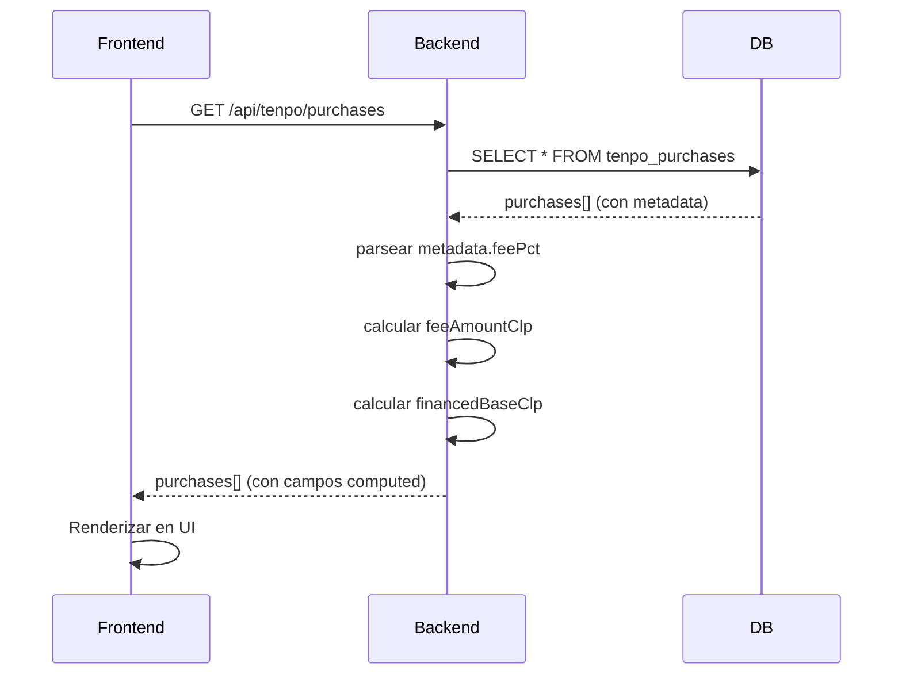

# Exposición de Fee por Operación - TenpoPurchase

**Fecha:** 31 de enero de 2026  
**Estado:** ✅ Implementado (Fase 1: Exposición)  
**Objetivo:** Agregar soporte para fee por operación sin migración compleja

---

## 📋 Resumen

Se agregó soporte para almacenar y exponer un **fee por operación** en compras Tenpo. Este fee representa cargos adicionales que Tenpo aplica al comercio y que pueden o no trasladarse al usuario final.

**Fase actual:** Solo **exposición** de datos (computed server-side)  
**Próxima fase:** Integrar fee en cálculo de cuotas

---

## 💾 Almacenamiento de feePct

### Campo Agregado: `metadata`

**Ubicación:** `TenpoPurchase.metadata`  
**Tipo:** `String?` (opcional, JSON serializado)  
**Schema Prisma:**

```prisma
model TenpoPurchase {
  // ... campos existentes
  metadata  String?  @map("metadata") // JSON string: { feePct: 0.02, ... }
  // ...
}
```

### Estructura JSON

```json
{
  "feePct": 0.02  // 2% fee (opcional, puede ser null)
}
```

**Valores posibles:**
- `null` o campo vacío: Sin fee (compras antiguas o sin cargo)
- `0.02`: 2% de fee sobre el capital (valor típico)
- Cualquier número entre 0 y 1 (porcentaje en formato decimal)

---

## 🧮 Cálculo del Fee

### Fórmula

```typescript
// Input
capital = purchase.amountTotalClp  // Ej: $218,365
feePct = metadata.feePct ?? null   // Ej: 0.02 (2%)

// Cálculo (solo si feePct !== null y modoMonto === 'ESTIMADO')
feeAmountClp = round(capital × feePct)
financedBaseClp = capital + feeAmountClp

// Ejemplo:
// capital = $218,365
// feePct = 0.02
// feeAmountClp = round(218365 × 0.02) = round(4367.3) = $4,367
// financedBaseClp = 218365 + 4367 = $222,732
```

### Reglas de Aplicación

1. **Solo en modo ESTIMADO:**
   - Fee se calcula y expone solo si `modoMonto === 'ESTIMADO'`
   - En modo `REAL`, fee es 0 (valor confirmado prevalece)

2. **Compatibilidad con compras antiguas:**
   - Si `metadata` es `null` o vacío → `feePct = null`
   - Si `feePct` es `null` → `feeAmountClp = 0`
   - No se rompen compras existentes ✅

3. **Server-side computed:**
   - Campos `feePct`, `feeAmountClp`, `financedBaseClp` son **calculados** en el servidor
   - No se persisten en DB (excepto `metadata`)
   - Se incluyen en respuesta JSON de API

---

## 🔌 API: GET /api/tenpo/purchases

### Respuesta Modificada

**Antes:**
```json
{
  "id": 123,
  "merchant": "COMERCIO XYZ",
  "amountTotalClp": 218365,
  "installmentsCount": 6,
  "modoMonto": "ESTIMADO",
  "totalFinanciadoEstimado": 246010,
  "interesTotalEstimado": 27645,
  // ...
}
```

**Después (con fee):**
```json
{
  "id": 123,
  "merchant": "COMERCIO XYZ",
  "amountTotalClp": 218365,
  "installmentsCount": 6,
  "modoMonto": "ESTIMADO",
  "totalFinanciadoEstimado": 246010,
  "interesTotalEstimado": 27645,
  "metadata": "{\"feePct\":0.02}",
  "feePct": 0.02,               // ← NUEVO (computed)
  "feeAmountClp": 4367,         // ← NUEVO (computed)
  "financedBaseClp": 222732,    // ← NUEVO (computed)
  // ...
}
```

**Sin fee (compra antigua):**
```json
{
  "id": 100,
  "merchant": "COMERCIO ANTIGUO",
  "amountTotalClp": 150000,
  "modoMonto": "ESTIMADO",
  "metadata": null,
  "feePct": null,               // ← Sin fee
  "feeAmountClp": 0,            // ← Sin fee
  "financedBaseClp": 150000,    // ← Solo capital
  // ...
}
```

**Modo REAL (ignora fee):**
```json
{
  "id": 456,
  "merchant": "COMERCIO CONFIRMADO",
  "amountTotalClp": 100000,
  "modoMonto": "REAL",
  "metadata": "{\"feePct\":0.02}",
  "feePct": 0.02,               // ← Presente pero no usado
  "feeAmountClp": 0,            // ← Ignorado en modo REAL
  "financedBaseClp": 100000,    // ← Valor confirmado prevalece
  // ...
}
```

---

## 📁 Archivos Modificados

### 1. Schema Prisma

**Archivo:** `node-version/prisma/schema.prisma`

**Cambio:**
```diff
model TenpoPurchase {
  id                        Int                @id @default(autoincrement())
  // ... campos existentes
+ metadata                  String?            @map("metadata") // JSON string: { feePct: 0.02, ... }
  email                     TenpoEmail         @relation(fields: [emailId], references: [id], onDelete: Cascade)
  // ...
}
```

**Migración creada:** `20260131204427_add_metadata_to_tenpo_purchases`

### 2. API Route

**Archivo:** `node-version/src/routes/tenpo.ts`

**Cambio:**
```typescript
router.get('/purchases', async (req, res) => {
  const purchases = await prisma.tenpoPurchase.findMany({ /* ... */ });

  // Agregar campos computed para fee (server-side)
  const purchasesWithFee = purchases.map((purchase: any) => {
    let feePct: number | null = null;
    let feeAmountClp = 0;
    let financedBaseClp = purchase.amountTotalClp;

    // Parsear metadata JSON si existe
    if (purchase.metadata) {
      try {
        const metadata = JSON.parse(purchase.metadata);
        feePct = metadata.feePct ?? null;
      } catch (error) {
        console.warn(`Error parsing metadata for purchase ${purchase.id}:`, error);
      }
    }

    // Calcular fee si existe (solo en modo ESTIMADO)
    if (feePct !== null && purchase.modoMonto === 'ESTIMADO') {
      feeAmountClp = Math.round(purchase.amountTotalClp * feePct);
      financedBaseClp = purchase.amountTotalClp + feeAmountClp;
    }

    return {
      ...purchase,
      feePct,
      feeAmountClp,
      financedBaseClp
    };
  });

  res.json(purchasesWithFee);
});
```

---

## ✅ Compatibilidad con Compras Antiguas

### Escenarios

| Escenario | `metadata` | `feePct` | `feeAmountClp` | `financedBaseClp` | Comportamiento |
|-----------|------------|----------|----------------|-------------------|----------------|
| **Compra antigua sin fee** | `null` | `null` | `0` | `capital` | ✅ Sin cambios |
| **Compra nueva con fee** | `"{\"feePct\":0.02}"` | `0.02` | `round(capital×0.02)` | `capital+fee` | ✅ Fee aplicado |
| **Compra REAL con fee** | `"{\"feePct\":0.02}"` | `0.02` | `0` | `capital` | ✅ Fee ignorado |
| **Metadata inválido** | `"invalid json"` | `null` | `0` | `capital` | ✅ Warning en logs |

### Testing de Compatibilidad

```sql
-- Verificar compras sin metadata (antiguas)
SELECT id, merchant, amountTotalClp, metadata 
FROM tenpo_purchases 
WHERE metadata IS NULL;
-- Resultado esperado: feePct=null, feeAmountClp=0

-- Verificar compras con metadata
SELECT id, merchant, amountTotalClp, metadata 
FROM tenpo_purchases 
WHERE metadata IS NOT NULL;
-- Resultado esperado: feePct parseado correctamente
```

---

## 🔄 Flujo de Datos



---

## 📊 Ejemplo Numérico

### Compra con Fee de 2%

```
Capital (amountTotalClp):     $218,365
Fee (2%):                     $4,367
Base Financiada:              $222,732

Tasa interés (2.11%):         2.11%
N° cuotas:                    6

Interés (TenpoAddOnV1):       
  interesTotal = round(222732 × 0.0211 × 6)
  interesTotal = round(28,207.6)
  interesTotal = $28,208

Total Financiado:             $250,940
Cuota estimada:               ~$41,823

Desglose:
  Capital:        $218,365 (monto de compra)
  + Fee:          $4,367   (2% cargo adicional)
  = Base:         $222,732 (base para calcular interés)
  + Interés:      $28,208  (interés sobre base)
  = Total:        $250,940 (total a pagar)
```

### Comparación: Sin Fee vs Con Fee

| Concepto | Sin Fee | Con Fee 2% | Diferencia |
|----------|---------|------------|------------|
| Capital | $218,365 | $218,365 | - |
| Fee | $0 | $4,367 | +$4,367 |
| Base Financiada | $218,365 | $222,732 | +$4,367 |
| Interés (2.11% × 6) | $27,645 | $28,208 | +$563 |
| Total Financiado | $246,010 | $250,940 | +$4,930 |
| Cuota Mensual | $41,002 | $41,823 | +$821 |

**Impacto del fee:**
- Incremento en total financiado: **+$4,930** (2.00%)
- Incremento en cuota mensual: **+$821** (2.00%)

---

## ⚠️ Limitaciones Actuales

### 1. Fee NO se Usa en Cálculo de Cuotas

**Estado actual:** Fee solo se **expone** como información  
**Próximo paso:** Integrar `financedBaseClp` en `calcularCuotasTenpoAddOnV1()`

```typescript
// ACTUAL (NO USA FEE):
calcularCuotasTenpoAddOnV1(capital, nCuotas, tasaMensual)

// PRÓXIMO (USARÁ FEE):
calcularCuotasTenpoAddOnV1(financedBaseClp, nCuotas, tasaMensual)
```

### 2. No hay UI para Editar Fee

**Workaround manual:**
```sql
-- Agregar fee a una compra específica
UPDATE tenpo_purchases 
SET metadata = '{"feePct":0.02}' 
WHERE id = 123;

-- Remover fee
UPDATE tenpo_purchases 
SET metadata = NULL 
WHERE id = 123;
```

### 3. No se Persiste en Sincronización

Al sincronizar desde Gmail, las compras nuevas **NO tendrán fee automáticamente**.  
Requiere asignación manual o lógica en `POST /sync`.

---

## 🧪 Verificación en API

### 1. Sin Fee (Compra Antigua)

```bash
curl http://localhost:3000/api/tenpo/purchases
```

**Buscar compra sin metadata:**
```json
{
  "id": 1,
  "merchant": "COMPRA_ANTIGUA",
  "amountTotalClp": 100000,
  "metadata": null,
  "feePct": null,           // ✅ null
  "feeAmountClp": 0,        // ✅ sin fee
  "financedBaseClp": 100000 // ✅ igual al capital
}
```

### 2. Agregar Fee Manualmente (SQL)

```sql
-- Agregar fee de 2% a compra ID 1
UPDATE tenpo_purchases 
SET metadata = '{"feePct":0.02}' 
WHERE id = 1;
```

**Verificar en API:**
```json
{
  "id": 1,
  "merchant": "COMPRA_ANTIGUA",
  "amountTotalClp": 100000,
  "metadata": "{\"feePct\":0.02}",
  "feePct": 0.02,           // ✅ 2%
  "feeAmountClp": 2000,     // ✅ 100000 × 0.02 = 2000
  "financedBaseClp": 102000 // ✅ 100000 + 2000
}
```

### 3. Compra en Modo REAL (Ignora Fee)

```sql
-- Crear compra en modo REAL con fee
INSERT INTO tenpo_purchases (..., modoMonto, metadata) 
VALUES (..., 'REAL', '{"feePct":0.02}');
```

**Verificar en API:**
```json
{
  "id": 999,
  "modoMonto": "REAL",
  "amountTotalClp": 100000,
  "metadata": "{\"feePct\":0.02}",
  "feePct": 0.02,           // ✅ Presente
  "feeAmountClp": 0,        // ✅ Ignorado (modo REAL)
  "financedBaseClp": 100000 // ✅ Valor confirmado prevalece
}
```

---

## 🎯 Próximos Pasos

### Fase 2: Integrar Fee en Cálculo de Cuotas

**Archivo:** `node-version/src/services/tenpo-calculator.service.ts`

**Cambio propuesto:**

```typescript
// Modificar generarCalendarioCuotas() para recibir feePct opcional
generarCalendarioCuotas(
  capital: number,
  nCuotas: number,
  fechaPrimeraCuota: Date,
  tieneInteres: boolean,
  tasaMensual: number,
  feePct?: number | null  // ← NUEVO parámetro
): { cuotas: number[]; totalFinanciado: number; interesTotal: number; feeAmountClp: number } {
  
  // Calcular base financiada con fee
  const feeAmountClp = feePct ? Math.round(capital * feePct) : 0;
  const financedBaseClp = capital + feeAmountClp;
  
  if (tieneInteres) {
    // Calcular interés sobre la base financiada (capital + fee)
    return this.calcularCuotasTenpoAddOnV1(financedBaseClp, nCuotas, tasaMensual);
  } else {
    // Sin interés: dividir base financiada
    // ...
  }
}
```

### Fase 3: UI para Gestionar Fee

- Mostrar desglose en detalle de compra:
  ```
  Capital:        $218,365
  + Fee (2%):     $4,367
  = Base:         $222,732
  + Interés:      $28,208
  = Total:        $250,940
  ```

- Permitir editar/remover fee desde UI
- Aplicar fee automáticamente en sincronización (configurable)

---

## 📝 Notas Técnicas

### ¿Por qué JSON en String?

- ✅ **Evita migración compleja:** SQLite no tiene tipo JSON nativo
- ✅ **Flexible:** Permite agregar más campos sin migración
- ✅ **Compatible:** Prisma soporta String para JSON serializado
- ⚠️ **Limitación:** No se puede consultar directamente en SQL

### Alternativas Consideradas

1. **Campo `feePct` directo (Float?):**
   - ❌ Requiere nueva columna para cada campo adicional
   - ❌ No extensible

2. **Tabla separada `TenpoFee`:**
   - ❌ Overkill para un solo campo opcional
   - ❌ Complejiza queries

3. **JSON nativo (PostgreSQL):**
   - ❌ Requiere cambiar de SQLite a PostgreSQL
   - ❌ Migración compleja

**Decisión:** String con JSON serializado es el balance óptimo

---

## 📚 Referencias

- Documento anterior: `docs/tenpo_addon_v1_impl.md`
- Schema Prisma: `node-version/prisma/schema.prisma`
- API Routes: `node-version/src/routes/tenpo.ts`
- Migración: `node-version/prisma/migrations/20260131204427_add_metadata_to_tenpo_purchases/`

---

**Implementado por:** GitHub Copilot  
**Fecha:** 31 de enero de 2026  
**Estado:** ✅ Fase 1 completa - Fee expuesto en API  
**Próximo:** Fase 2 - Integrar fee en cálculo de cuotas
